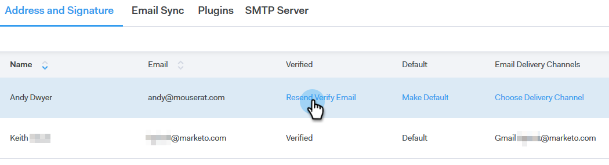

# Uw e-mail verifiëren {#verify-your-email}

Voer de onderstaande stappen uit als u een e-mailidentiteit hebt die niet is geverifieerd.

1. Klik op het tandwielpictogram rechtsboven en kies **[!UICONTROL Settings]** .

   

1. Klik onder [!UICONTROL My Account] op **[!UICONTROL Email Settings]** .

   

1. Zoek onder [!UICONTROL Address and Signature] de e-mailidentiteit die u wilt verifiëren en klik op **[!UICONTROL Resend Verify Email]** . Er wordt een nieuw e-mailverificatiebericht verzonden.

   

1. Klik op **[!UICONTROL Resend]**.

   

1. De ontvanger opent vervolgens het e-mailbericht en volgt de stappen om de e-mailidentiteit te verifiëren.

   
