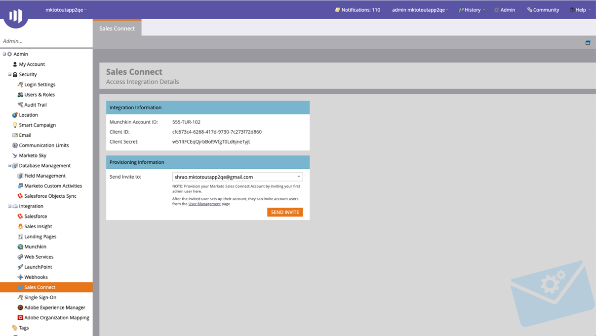

# Aan de slag voor Connect-beheerders {#getting-started-guide-for-sales-connect-admins}

Dit document begeleidt u door de eerste stappen voor het instellen van uw nieuwe exemplaar van Sales Connect. Voor sommige van deze stappen is toegang vereist als Marketo-beheerder, Salesforce-beheerder en Sales Connect-beheerder. Volg de onderstaande hulplijnen om de installatie van de instantie te voltooien.

>[!NOTE]
>
>**Beheerdersmachtigingen vereist.**

## Toegang tot uw nieuwe Marketo Sales Connect-account {#accessing-your-new-marketo-sales-connect-account}

Als u Marketo Sales Connect hebt aangeschaft, wordt de toegang tot uw exemplaar ingericht via de beheersectie van Marketo. [Klik hier](/help/marketo/product-docs/marketo-sales-connect/getting-started/accessing-your-new-sales-connect-instance.md) voor instructies over hoe een Marketo-beheerder toegang kan verlenen tot uw nieuwe exemplaar.

## Gebruikers uitnodigen en beheren {#inviting-and-managing-users}

Zodra u uw Marketo Sales Connect-account van Marketo hebt ingericht en uw eerste beheerder hebt uitgenodigd, kan die beheerder extra gebruikers uitnodigen via de Marketo Sales Connect-pagina voor gebruikersbeheer. [Klik hier](/help/marketo/product-docs/marketo-sales-connect/admin/invite-users.md) om te zien hoe u gebruikers kunt uitnodigen vanaf de pagina voor gebruikersbeheer.

## Verbinding maken met Salesforce {#connecting-to-salesforce}

Alle gebruikers zullen individueel met Salesforce moeten verbinden om de activiteiten van de logboekverkoop aan verkoop zoals e-mail, vraag, en taken toe te laten. Wanneer u echter verbinding maakt met Salesforce als beheerder, hebt u de gelegenheid om uw instellingen voor het registreren van activiteiten te configureren voor uw gehele team, zodat algemene loginstellingen worden toegepast op alle gebruikers van Sales Connect.

Als u uw exemplaar van Sales Connect wilt verbinden met uw exemplaar van Salesforce, als Admin of een niet-Admin, voert u de volgende stappen uit in [dit artikel](/help/marketo/product-docs/marketo-sales-connect/crm/salesforce-integration/connect-your-sales-connect-account-to-salesforce.md).

## Verbinding maken met Marketo {#connecting-to-marketo}

Als je je op Marketo aansluit, kunnen je verkopers gebruikmaken van de kracht van marketing, automatisering en marketing inzichten in hun prospectieve activiteiten. Voor de volgende functies moet u een integratie met Marketo instellen.

* Delen [marketingcampagnes](/help/marketo/product-docs/marketo-sales-connect/marketo/make-a-campaign-visible-to-sales-connect-users.md) met verkopers
* Push [Interesserende momenten](/help/marketo/product-docs/marketo-sales-connect/marketo/interesting-moments-in-sales-connect.md) aan de Levende Diervoeders
* Verkoopactiviteiten aan Marketo registreren

Klik hier voor meer informatie over het maken van een verbinding met Marketo en het verlenen van toegang aan verkoopgebruikers tot de verbinding.

## Salesforce-aanpassingspakket installeren {#installing-salesforce-customization-package}

Een deel van het ervoor zorgen dat verkoop voor succes wordt toegelaten betekent het hebben van de juiste mogelijkheden in hun primaire werkruimte. Met het aanpassingspakket voor Sales Connect kunnen servicemogelijkheden en belangrijke kenmerken voor verkoopactiviteiten vanuit Salesforce worden benaderd.

Meer informatie over de installatie van de aanpassing van Sales Connect [klik hier](/help/marketo/product-docs/marketo-sales-connect/crm/salesforce-customization/sales-connect-customizations-for-crm.md).

## Testen in sandbox {#testing-in-sandbox}

Voor teams die Marketo Sales Connect willen testen met hun Marketo-sandbox, kan op verzoek een extra Sales Connect-account worden ingericht. Dit geldt alleen voor klanten die een Marketo-sandbox hebben aangeschaft of voor klanten die deze als onderdeel van hun Marketo-pakket hebben. Neem contact op met uw Marketo-accountmanager als u een sandbox wilt aanschaffen.

>[!NOTE]
>
>U kunt een Sales Connect-account met dezelfde e-mailid niet op meerdere exemplaren instellen. Dit betekent dat als u een extra Sales Connect-account wilt hebben om te testen met uw Marketo Sandbox-exemplaar, u in elk van de accounts een andere e-mailid moet gebruiken.

>[!MORELIKETHIS]
>
>[Beheerdersrechten](/help/marketo/product-docs/marketo-sales-connect/admin/user-access-details.md)
