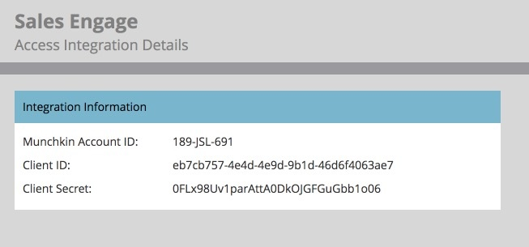
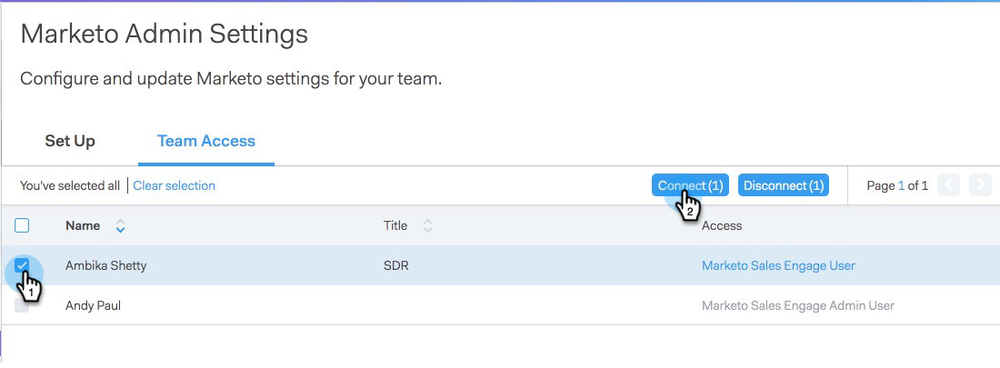

# Aan de slag met Sales Connect {#getting-started-with-sales-connect}

Als u deze stappen liever wilt bekijken dan deze te lezen, gaat u recht naar de [Video-instructies onder](#video).

>[!AVAILABILITY]
>
>Niet alle klanten hebben deze functionaliteit aangeschaft. Neem voor meer informatie contact op met de succesmanager van de klant.

## Wat u nodig hebt om aan de slag te gaan {#what-you-need-to-get-started}

* Abonnement op Marketo
* Abonnement op Sales Connect
* Salesforce-abonnement (met API-aanroepen en Apex-klassen ingeschakeld)

## Wie u aan de slag moet {#who-you-need-to-get-started}

* Gebruiker Marketo Admin
* Gebruiker van Connect Admin verkopen
* Salesforce Admin
* Connect-gebruikers verkopen

## Sales Connect Admins {#sales-connect-admins}

U ontvangt een e-mail van Marketo met een koppeling om uw wachtwoord opnieuw in te stellen. Nadat u een nieuw wachtwoord hebt gemaakt, meldt u zich aan bij Sales Connect.

Voer de volgende handelingen uit om de installatie te voltooien:

* [Connect Sales Connect en Salesforce](#sfdc)
* [Credentials aanschaffen voordat u verkoop verbindt met Marketo](#acquire)
* [Connect Sales Connect met Marketo](#mkto)
* [Gebruikers uitnodigen/leveren](#IPU)

U kunt ook:

* [Verkoopverbinding testen in uw sandbox](#sandbox)

## Verbind Uw Verkoop Connect Rekening met Salesforce {#connect-your-sales-connect-account-to-salesforce}

Als u uw Sales Connect-account wilt koppelen aan uw Salesforce-account, als beheerder of een niet-beheerder, voert u de stappen in [dit artikel](https://docs.marketo.com/x/JwDb) uit.

>[!NOTE]
>
>De instantie van Salesforce waarmee u verbinding maakt, moet dezelfde instantie zijn die met Marketo is (of zal worden) verbonden.

## Credentials verkrijgen voorafgaand aan het verbinden van Verkoop verbindt met Marketo {#acquiring-credentials-prior-to-connecting-sales-connect-with-marketo}

U zult een reeks geloofsbrieven van binnen Marketo moeten krijgen. Deze gegevens worden later gebruikt door de Sales Connect Admin om Marketo te verbinden met Sales Connect.

1. Klik in Marketo op **Admin**.

   

1. Klik in de structuur op **Verkoop Connect**.

   

1. Selecteer de volgende Marketo-referenties en stuur deze naar uw Sales Connect-beheerder: Munchkin-id, client-id, clientgeheim.

   

   >[!NOTE]
   >
   >Wanneer u de bovenstaande gegevens kopieert en plakt, moet u ervoor zorgen dat er geen spaties worden toegevoegd.

## Verkoop verbinden met Marketo {#connect-sales-connect-to-marketo}

1. Klik in Sales Connect op het tandwielpictogram en selecteer **Instellingen**.

   

1. Selecteer **Marketo** onder Beheerinstellingen.

   

1. Voer de Marketo-gegevens in die door Marketo Admin worden verschaft en klik op **Connect**.

   

## Gebruikers {#invite-provision-users} uitnodigen/voorzien

Als er al gebruikers in uw account aanwezig zijn (voorheen van ToutApp), worden deze weergegeven op het tabblad **Teamtoegang** van het gedeelte Marketo van Sales Connect.

U kunt uw team vanaf deze pagina instellen als een Connect-gebruiker van een Marketo-verkoop. Als u nog nooit ToutApp hebt gebruikt of nog gebruikers moet uitnodigen, voert u de stappen in [dit artikel](https://docs.marketo.com/display/TOUT/Invite+Team+Members) uit.

>[!CAUTION]
>
>Wacht tien minuten nadat u Sales Connect met Marketo hebt verbonden voordat u deze stappen uitvoert.

1. Selecteer een of meer gebruikers en klik op **Connect**.

   >[!NOTE]
   >
   >U kunt de werkruimte slechts eenmaal toewijzen op het moment dat u gebruikers uitnodigt. Nadat het wordt geplaatst, zult u de gebruiker moeten losmaken om het te veranderen.

   

1. Als werkruimten zijn ingeschakeld voor uw abonnement op Marketo, kunt u werkruimten toewijzen aan elke gebruiker of aan elke set gebruikers in bulk. Als er geen werkruimten zijn geselecteerd, wijzen we deze toe aan de werkruimte Standaardmarkering.

   

1. Klik op de vervolgkeuzelijst Werkruimte, selecteer de gewenste werkruimte(n) en klik op **Verbinden**.

   

   >[!NOTE]
   >
   >Als u nieuwe gebruikers wilt toevoegen, ga naar de sectie van het Beheer van het Team van Montages Admin en klik **Invite Users** knoop.

U kunt extra gebruikers van de pagina van het Beheer van het Team en de stappen hierboven volgen om hen te krijgen verbonden.

## Verkoopverbinding testen in uw sandbox {#test-sales-connect-in-your-sandbox}

Voor teams die Marketo Sales Connect willen testen met hun Marketo-sandbox, kan op verzoek een extra Sales Connect-account worden ingericht. Dit geldt alleen voor klanten die een Marketo-sandbox hebben aangeschaft of voor klanten die deze als onderdeel van hun Marketo-bundel hebben. Neem contact op met uw accountmanager van Marketo als u een sandbox wilt aanschaffen.

>[!NOTE]
>
>U kunt een Sales Connect-account met dezelfde e-mailid niet op meerdere exemplaren instellen. Dit betekent dat als u een extra Sales Connect-account wilt hebben om te testen met uw Marketo Sandbox-exemplaar, u in elk van de accounts een andere e-mailid moet gebruiken.
