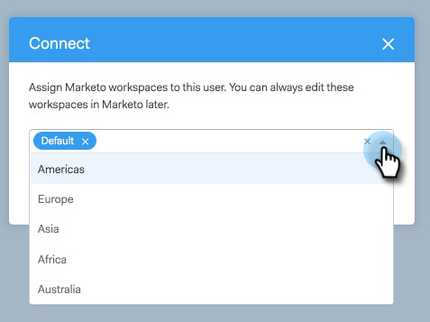

# Toegang verlenen aan gebruikers {#granting-access-to-users}

Voer de stappen in dit artikel uit om uw [!DNL Sales Connect] -gebruikers toegang te verlenen tot de Marketo-verbinding. Hierdoor worden functies zoals Interessant Moments in de live feed en toegang tot marketingcampagnes ontgrendeld.

U zult gebruikers [!DNL Sales Connect] [&#128279;](/help/marketo/product-docs/marketo-sales-connect/admin/invite-users.md) moeten uitnodigen, alvorens zij in Marketo > [!UICONTROL Team Access] pagina (in [!DNL Sales Connect]) zichtbaar zijn, waar de toegang tot de verbinding van Marketo wordt verleend.

>[!CAUTION]
>
>Wacht tien minuten nadat u verbinding hebt gemaakt met [!DNL Sales Connect] met Marketo voordat u deze stappen uitvoert.

1. Selecteer een of meer gebruikers en klik op **[!UICONTROL Connect]** .

   >[!NOTE]
   >
   >U kunt de werkruimte slechts eenmaal toewijzen op het moment dat gebruikers toegang krijgen. Nadat het wordt geplaatst, zult u de gebruiker moeten losmaken om het te veranderen.

   

1. Als werkruimten zijn ingeschakeld voor uw Marketo-abonnement, kunt u werkruimten toewijzen aan elke gebruiker of aan een set gebruikers in bulk. Als er geen werkruimten zijn geselecteerd, wijzen we deze toe aan de standaardwerkruimte van Marketo.

   

1. Klik op de vervolgkeuzelijst Workspace, selecteer de gewenste werkruimte(n) en klik op **[!UICONTROL Connect]** .

   

U kunt extra gebruikers van de pagina van het Beheer van het Team en de stappen hierboven volgen om hen te krijgen verbonden.
