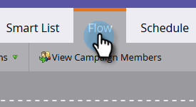

# Een campagne zichtbaar maken voor [!DNL Sales Connect] gebruikers {#make-a-campaign-visible-to-sales-connect-users}

Campagnes kunnen alleen worden gedeeld als ze zichtbaar worden gemaakt. Zo doe je dat.

1. Selecteer (of maak) de campagne die u wilt delen.

   

1. Klik op de tab **[!UICONTROL Smart List]** .

   

1. Voeg de trigger [!UICONTROL Campaign is Requested] toe.

   

1. Kies &quot;[!UICONTROL is]&quot; **[!UICONTROL Web Service API]** voor de bron.

   

1. Klik op de tab **[!UICONTROL Flow]** .

   

1. Voeg de handeling [!UICONTROL Interesting Moment] flow toe.

   

1. Selecteer [!UICONTROL Type] bij **[!UICONTROL Web]** .

   

1. Schrijf in het vak [!UICONTROL Description] een bericht naar uw verkoopteam. In dit voorbeeld gebruiken we tokens om het formulier op te geven dat is ingevuld.

   

1. Klik op het tabblad **[!UICONTROL Schedule]** en **[!UICONTROL Activate]** de campagne.

   
