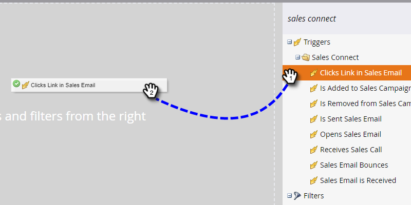

# Triggers en filters voor verkoopactiviteiten {#sales-activity-triggers-and-filters}

Als je de betrokkenheid van je verkoopteam beter wilt coördineren, of als je probeert een beter beeld te krijgen van hoe ze met klanten samenwerken over de heen-en-klantreis, zullen Sales Activity Insights in Marketo nuttig zijn voor je.

Volg de onderstaande stappen om te leren hoe u verkoopactiviteitfilters en -triggers kunt gebruiken in uw slimme campagnes.

1. Zoek en selecteer de gewenste slimme campagne.

   

1. In de **Slimme lijst** , zoekt u &quot;Sales Apps&quot;.

   

1. Selecteer en sleep over het gewenste filter of de gewenste trigger.

   

1. Selecteer de gewenste restricties.

   

>[!NOTE]
>
>Voor een volledige lijst met activiteiten, beperkingen en definities raadpleegt u onze [Verklarende woordenlijst Verkoopactiviteiten](/help/marketo/product-docs/marketo-sales-connect/marketo/sales-activity-glossary.md).
