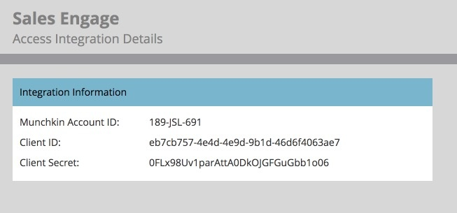

# Uw Marketo-verbinding instellen {#set-up-your-marketo-connection}

>[!NOTE]
>
>Wanneer u MSC instelt, stuurt Marketo automatisch uw referenties naar [!DNL Sales Connect] en verbindt het uw instantie met Marketo. Deze stap wordt vereist **slechts als u niet de verbinding die** wordt gevestigd ziet nadat uw [!DNL Sales Connect] instantie provisioned is. Als de verbinding tot stand is gebracht, worden uw gegevens weergegeven die u hebt ingevoerd op de pagina Marketo Admin Settings.

## Credentials aanschaffen voordat u verbinding maakt met [!DNL Sales Connect] Marketo {#acquiring-credentials-prior-to-connecting-sales-connect-with-marketo}

U hebt een set aanmeldingsgegevens nodig vanuit Marketo. Deze gegevens worden later door de [!DNL Sales Connect] Admin gebruikt om Marketo te verbinden met [!DNL Sales Connect] .

1. Klik in Marketo op **[!UICONTROL Admin]** .

   

1. Klik in de structuur op **[!UICONTROL Sales Engage]** .

   

1. Selecteer de volgende Marketo-referenties en verzend deze naar uw [!DNL Sales Connect] Admin: [!UICONTROL Munchkin Account ID] , [!UICONTROL Client ID] , [!UICONTROL Client Secret] .

   

   >[!NOTE]
   >
   >Wanneer u de bovenstaande gegevens kopieert en plakt, moet u ervoor zorgen dat er geen spaties worden toegevoegd.

## Verbinden [!DNL Sales Connect] met Marketo {#connect-sales-connect-to-marketo}

1. Klik in [!DNL Sales Connect] op het tandwielpictogram en selecteer **[!UICONTROL Settings]** .

   

1. Selecteer onder [!UICONTROL Admin Settings] de optie **[!UICONTROL Marketo]** .

   

1. Voer de Marketo-gegevens in die door de Marketo Admin worden opgegeven en klik op **[!UICONTROL Connect]** .

   
