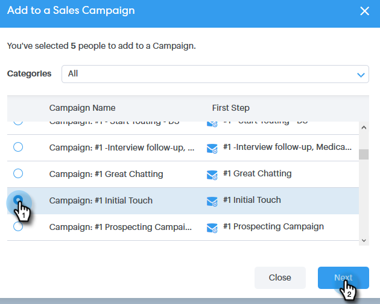

# Verbinding maken met een groep {#connecting-with-a-group}

Leer hoe u een e-mail naar een volledige groep verzendt of een groep aan een campagne toevoegt.

## Groepactie: E-mail {#group-action-email}

1. Selecteer de groep die u per e-mail wilt verzenden.

   

1. Klik op de knop **Handelingen groeperen** en selecteer **Groep e-mailen**.

   

1. Vul uw e-mail in en plant/verzend het.

   

   Dat is het. Iedereen in die groep zal de e-mail ontvangen.

## Groepactie: Toevoegen aan verkoopcampagne {#group-action-add-to-sales-campaign}

1. Selecteer de groep die u aan een campagne wilt toevoegen.

   

1. Klik op de knop **Handelingen groeperen** en selecteer **Groep toevoegen aan campagne**.

   

1. Bevestig dat de juiste personen zijn geselecteerd en klik op **Volgende**.

   

   >[!NOTE]
   >
   >Mogelijk ziet u een optie om toe te voegen aan een Marketo-campagne. [Dat is een ander artikel](/help/marketo/product-docs/marketo-sales-connect/campaigns/add-to-marketing-campaign.md).

1. Selecteer een campagne (u kunt een categorie selecteren om uw resultaten te verfijnen) en klik **Volgende**.

   

1. Breng desgewenst wijzigingen aan en klik op **Volgende**.

   

1. Plan de campagne en klik **Start**.

   
