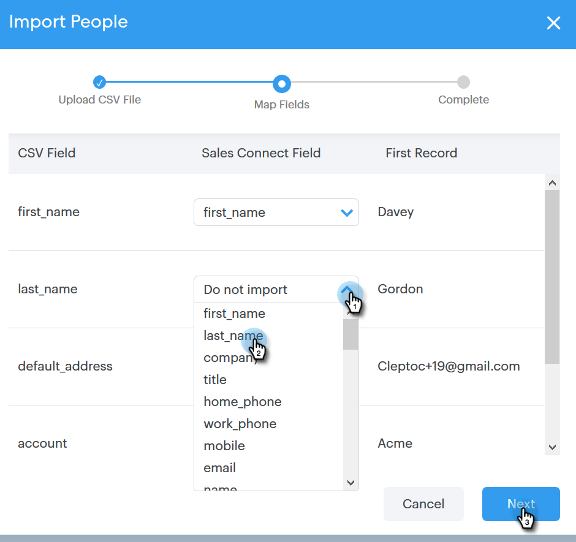

# Contacten importeren via CSV {#import-contacts-via-csv}

Het is belangrijk dat u contactpersonen op de pagina [!UICONTROL People] hebt, omdat we hiermee automatisch persoonlijke gegevens in de dynamische velden in uw sjablonen invullen. Zorg ervoor dat u ten minste een naam en een e-mailadres hebt voor elke contactpersoon in de CSV en dat u een koppeling naar deze velden maakt.

1. Selecteer de groep (of maak een nieuwe groep) op het tabblad [!UICONTROL People] .

   

1. Klik op **[!UICONTROL Group Actions]** en selecteer **[!UICONTROL Import from CSV]** .

   

1. Klik op **[!UICONTROL Browse]**.

   

1. Zoek het bestand op de computer en selecteer het.

   >[!NOTE]
   >
   >Groepen zijn beperkt tot 1000 contacten.

1. Klik op **[!UICONTROL Next]**.

   

1. Wijs de kolommen in uw CSV aan hun respectieve gebieden in [!DNL Sales Connect] toe. Klik op **[!UICONTROL Next]** als u klaar bent.

   
