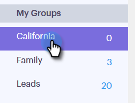
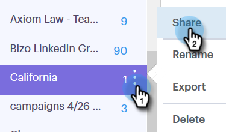

# Groepen beheren {#manage-groups}

Leer hoe u uw groepen beheert in [!DNL Sales Connect] .

## Een groep maken {#create-a-group}

1. Klik op de pagina [!UICONTROL People] op **+** naast [!UICONTROL Groups] .

   

1. Geef de groep een naam en klik op **[!UICONTROL Create]** .

   

   Dat is het!

## Contactpersonen toevoegen aan een groep {#add-contacts-to-a-group}

1. Zoek op de pagina [!UICONTROL People] naar de groep waaraan u personen wilt toevoegen en selecteer deze groep.

   

1. Klik op **[!UICONTROL Group Actions]** en selecteer **[!UICONTROL Create Contact]** .

   

   >[!NOTE]
   >
   >Hiermee voegt u één contactpersoon tegelijk toe. Om veelvoudige contacten tezelfdertijd toe te voegen, volg [ deze stappen ](/help/marketo/product-docs/marketo-sales-connect/people/managing-contacts/import-contacts-via-csv.md).

1. Vul de contactgegevens in en klik op **[!UICONTROL Create]** (of **[!UICONTROL Create and Add New]** om een andere contactpersoon toe te voegen).

   

   En je bent klaar!

   >[!NOTE]
   >
   >U zou kunnen moeten raken verfrist zich om het even welke nieuwe toegevoegde contacten te zien.

## Een groep delen {#share-a-group}

1. Zoek op de pagina [!UICONTROL People] naar de groep die u wilt delen en selecteer deze.

   

1. Klik op de gegevens (drie verticale stippen) en selecteer **[!UICONTROL Share]** .

   

1. Klik op de vervolgkeuzelijst en kies het team waarmee u de groep wilt delen.

   

1. Klik op **[!UICONTROL Share]**.

   

   U hebt nog steeds de groep, maar deze wordt nu onder [!UICONTROL Team Groups] weergegeven.

## Delen van een groep opheffen {#unshare-a-group}

1. Zoek op de pagina [!UICONTROL People] naar de groep waarvan u het delen wilt opheffen en selecteer deze.

   

1. Klik op de gegevens (drie verticale stippen) en selecteer **[!UICONTROL Share]** .

   

1. Klik **X** naast het team u de groep met deelde, dan klik uit modaal.

   

   De groep wordt nu niet gedeeld.

## De naam van een groep wijzigen {#rename-a-group}

1. Zoek op de pagina [!UICONTROL People] naar de groep waarvan u de naam wilt wijzigen en selecteer deze.

   

1. Klik op de gegevens (drie verticale stippen) en selecteer **[!UICONTROL Rename]** .

   

1. Typ de nieuwe naam en druk op Enter.

   

## Een groep verwijderen {#delete-a-group}

1. Zoek op de pagina [!UICONTROL People] naar de groep die u wilt verwijderen en selecteer deze.

   

1. Klik op de gegevens (drie verticale stippen) en selecteer **[!UICONTROL Delete]** .

   

1. Klik op **[!UICONTROL Delete]** om te bevestigen.

   
