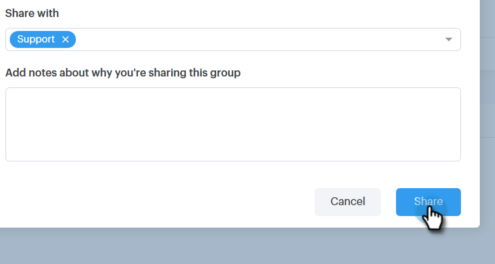

# Groepen beheren {#manage-groups}

Leer hoe u uw groepen beheert in Sales Connect.

## Een groep maken {#create-a-group}

1. Klik op de pagina Personen op het **plusteken** naast Groepen.

   

1. Geef de groep een naam en klik op **Maken**.

   

   Dat is het!

## Contactpersonen toevoegen aan een groep {#add-contacts-to-a-group}

1. Zoek op de pagina Personen naar de groep waaraan u personen wilt toevoegen en selecteer deze groep.

   

1. Klik op Handelingen **** groeperen en selecteer Contactpersoon **maken**.

   

   >[!NOTE]
   >
   >Hiermee voegt u één contactpersoon tegelijk toe. Om veelvoudige contacten tezelfdertijd toe te voegen, volg [deze stappen](http://docs.marketo.com/x/VADb).

1. Vul de gegevens van de contactpersoon in en klik op **Maken** (of **Maken en Nieuw** toevoegen om een andere contactpersoon toe te voegen).

   

   En je bent klaar!

   >[!NOTE]
   >
   >U zou kunnen moeten raken verfrist zich om het even welke nieuwe toegevoegde contacten te zien.

## Een groep delen {#share-a-group}

1. Zoek en selecteer op de pagina Personen de groep die u wilt delen.

   

1. Klik op de gegevens (drie verticale stippen) en selecteer **Delen**.

   

1. Klik op de vervolgkeuzelijst en kies het team waarmee u de groep wilt delen.

   

1. Klik op **Delen**.

   

   U hebt nog steeds de groep, maar deze wordt nu weergegeven onder Teamgroepen.

## Delen van een groep opheffen {#unshare-a-group}

1. Zoek en selecteer op de pagina Personen de groep waarvan u het delen wilt opheffen.

   

1. Klik op de gegevens (drie verticale stippen) en selecteer **Delen**.

   

1. Klik op de **X** naast het team waarmee u de groep hebt gedeeld en klik vervolgens uit het modaal.

   

   De groep wordt nu niet gedeeld.

## De naam van een groep wijzigen {#rename-a-group}

1. Zoek op de pagina Personen naar de groep waarvan u de naam wilt wijzigen en selecteer deze groep.

   

1. Klik op de gegevens (drie verticale stippen) en selecteer **Naam wijzigen**.

   

1. Typ de nieuwe naam en druk op Enter.

   

## Een groep verwijderen {#delete-a-group}

1. Zoek en selecteer op de pagina Personen de groep die u wilt verwijderen.

   

1. Klik op de gegevens (drie verticale stippen) en selecteer **Verwijderen**.

   

1. Klik op **Verwijderen** om te bevestigen.

   

