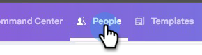
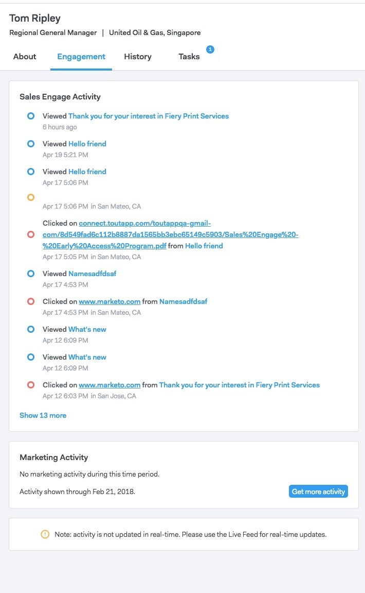
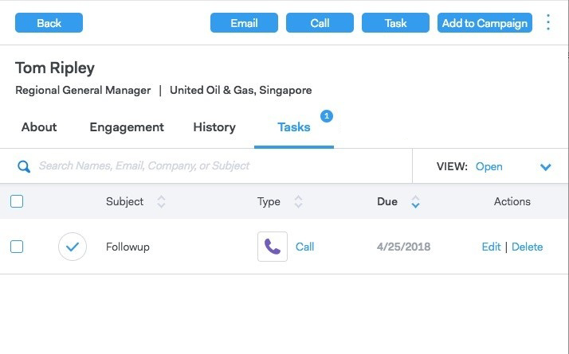

# Persoonsgegevens weergeven {#person-detail-view}

De de detailmening van de persoon verstrekt een gedetailleerd profiel van elke persoon in uw rekening MSC.

## Toegang verkrijgen {#how-to-access}

1. Klik op de tab **[!UICONTROL People]** om de weergave met persoonsdetails te openen.

   

1. Klik op de gewenste persoon.

   

   >[!TIP]
   >
   >Vaak overal waar je de naam van een persoon ziet, kun je erop klikken en naar de Gedetailleerde weergave van de persoon gaan.

## Info over Tab {#about-tab}

Bevat alle contactgegevens van de persoon.

**Kaart van het Contact**

* Bevat contactgegevens zoals: e-mailadres, naam, bedrijf, titel, telefoonnummer en koppelingen naar sociale media

**Groepen**

* Hiermee wordt weergegeven en beheerd welke groepen deze persoon lid is van

**de Informatie van de Rekening**

* Kan een persoon toevoegen aan [!DNL Salesforce]
* Account en informatie over lead/contact ophalen vanuit [!DNL Salesforce]

**de Gebieden van de Douane**

* Aangepaste velden toevoegen of verwijderen die kunnen worden gebruikt als dynamische velden in uw sjablonen en campagnes

**Nota&#39;s**

* Aangepaste notities maken

## Tabblad Betrokkenheid {#engagement-tab}

Zie hoe deze persoon werkt met je outreach.

**Verkoop verbindt Activiteit**

* Bekijk de betrokkenheidsactiviteiten van uw e-mails en campagnes voor verkoop

**de Marketing Activiteit**

* Kijk hoe je persoon marketingcampagnes voert

## Tabblad Historie {#history-tab}

Geeft je outreachegeschiedenis weer. Bevat e-mails, campagnes en oproepen.

**[!UICONTROL Sales Campaigns]**

* Bekijk actieve of voltooide campagnes waartoe deze persoon behoort

**[!UICONTROL Marketing Campaigns]**

* Zie alle marketingcampagnes waarbij deze persoon lid is van

**[!UICONTROL Sales Emails]**

* Bekijk alle e-mails die u deze persoon hebt verzonden en de gegevens over de betrokkenheid

**[!UICONTROL Sales Calls]**

* Zie om het even welke vraag u aan deze persoon hebt gemaakt

## Tabblad Taken {#tasks-tab}

Taken beheren die aan deze persoon zijn gekoppeld.

Handelingen die u kunt uitvoeren:

* Een taak bewerken of verwijderen
* Zie de vervaldatum
* Klik op Type om de Telefoon van de Verkoop te lanceren als Vraag, E-mail samenstelt als E-mail, Gekoppeld binnen als Inmail, en Nota van de Douane als Douane.
* Een taak markeren als voltooid
