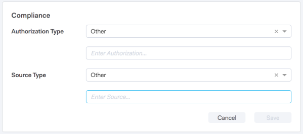

# Sales Connect en GDPR-compatibiliteit {#sales-connect-and-gdpr-compliance}

De algemene gegevensbeschermingsverordening (GDPR) is wetgeving van de Europese Unie die op 25 mei 2018 in werking is getreden.

## Overzicht {#overview}

Het doel is de rechten van betrokkenen binnen de Europese Unie (EU) en de Europese Economische Ruimte (EER) te versterken met betrekking tot de wijze waarop hun persoonsgegevens worden gebruikt en beschermd. &quot;Persoonsgegevens&quot; zijn gegevens die betrekking hebben op een geïdentificeerde of identificeerbare natuurlijke persoon.

De GDPR is gestructureerd rond zes basisbeginselen (nader omschreven in artikel 5 van de wetgeving):

1. Transparantie over de wijze waarop en waarvoor gegevens zullen worden gebruikt.
1. Ervoor zorgen dat de verzamelde gegevens alleen worden gebruikt voor de doeleinden die uitdrukkelijk op het tijdstip van de verzameling worden vermeld.
1. De gegevensverzameling beperken tot wat nodig is voor het doel waarvoor ze wordt verzameld.
1. Ervoor zorgen dat de gegevens correct zijn.
1. De gegevens worden slechts opgeslagen zolang als nodig is binnen het beoogde doel.
1. Preventie tegen ongeoorloofd gebruik of onopzettelijk verlies van gegevens door het nemen van passende beveiligingsmaatregelen.

Bovendien is er een nieuwe verantwoordingsplicht om te kunnen aantonen hoe naleving wordt beheerd en gevolgd. Dit betekent dat er een register moet worden bijgehouden van hoe en waarom persoonsgegevens zijn verzameld en van de processen die zijn ingevoerd om deze te beschermen.

## Op wie is het van toepassing? {#to-whom-does-it-apply}

De GDPR is van toepassing op elke organisatie binnen of buiten de EU die goederen of diensten verkoopt aan en/of het gedrag volgt van betrokkenen binnen de EU en de EER. Als je zaken doet met betrokkenen in Europa die de verwerking van hun persoonsgegevens impliceren, dan is deze wetgeving op jou van toepassing. De sancties wegens niet-naleving zijn aanzienlijk, met grote boetes voor degenen die de verordening overtreden; de maximumboete voor één enkele inbreuk bedraagt 20 miljoen eur of 4 % van de wereldwijde jaaromzet , afhankelijk van welk bedrag het grootst is .

## Implicaties voor marketing {#implications-for-marketing}

De handelaars streven ernaar klantenervaringen tot stand te brengen die persoonlijk en menselijk voelen, gebaseerd op vertrouwen en met zorg geleverd. Hoewel de GDPR deze termen niet gebruikt, zijn de doelen hetzelfde: de rechten van klanten respecteren en hun vertrouwen verdienen. Om dat vertrouwen te kunnen opbouwen en behouden, moeten marketers zich houden aan de manier waarop, wanneer en waarom hun klanten betrokken willen zijn. Het is van essentieel belang dat de voorkeuren van de klant worden gerespecteerd, niet alleen als een wettelijke vereiste, maar ook als de basis van klantgerichte betrokkenheidspraktijken.

Hoe de marketers deze hogere verwachtingen rond de inzameling, het gebruik, en de veiligheid van de persoonlijke gegevens richten die routinematig in de loop van hun werk worden gebruikt is zeer belangrijk, en de Marketo kan helpen met het voldoen aan die verwachtingen.

Er zijn twee belangrijke aspecten van de GDPR waar marketers vroegere, huidige en toekomstige praktijken moeten herzien. Het eerste punt is de instemming van het individu om zijn persoonsgegevens te verwerken, en het tweede is de verantwoordingsplicht, namelijk het kunnen aantonen van de naleving van de beginselen van de GDPR.

Wij verstrekken uitvoerige informatie over toestemming en verantwoordingsplicht binnen het platform van Marketo in ons e-boek, [GDPR en de Marketer](https://www.marketo.com/ebooks/the-gdpr-and-the-marketer/). In dit artikel zullen we ons echter specifiek richten op de nieuwe functies in Marketo Sales Connect die uw organisatie zullen helpen zich aan de GDPR-regels te houden.

## GDPR-compatibiliteit in Marketo Sales Connect {#gdpr-compliance-in-marketo-sales-connect}

Marketo Sales Connect is een krachtige toepassing—onderdeel van het Platform Marktbetrokkenheid—die een enkele workflow en weergave voor verkoop en marketing biedt, zodat de pijpleiding gezamenlijk sneller verloopt via collectieve betrokkenheid. De nieuwe functionaliteit in Marketo Sales Connect is speciaal gemaakt met het oog op GDPR-compatibiliteit. Wij zullen alle drie functies schetsen en uitleggen hoe zij, wanneer correct gebruikt, de naleving van GDPR van uw organisatie zullen helpen.

## Compatibiliteitskaart {#compliance-card}

Marketo Sales Connect bevat een compatibiliteitskaart in de weergave Details persoon om belangrijke informatie te verschaffen over het machtigingstype van een contactpersoon en het type bron. Hierdoor kunnen gebruikers eenvoudig informatie toevoegen en bijhouden die essentieel is voor de privacy van gegevens en kunnen ze beter geïnformeerde beslissingen nemen over de strategie voor campagne en outreach.

Type contactautorisatie

Binnen de Kaart van de Naleving, kunnen de gebruikers de wettelijke basis voor de verwerking van de persoonsgegevens van een contact door de drop-down van de Vergunning volgen. Als u het machtigingstype van een contactpersoon begrijpt, kunnen Connect-gebruikers met meer informatie beslissingen nemen over outreach-praktijken, zodat elke campagne of betrokkenheid legaal en geschikt is.

Gebruikers kunnen kiezen uit een groot aantal opties, waaronder:

* Toestemming
* Gewettigd belang
* Uitvoering van een opdracht
* Naleving van de wettelijke verplichting
* Bescherming van vitale belangen
* Openbaar belang/Overheidsinstantie
* Overige

Brontype van contactpersoon

Binnen de nieuwe Kaart van de Naleving, kunnen de gebruikers de bron van een contact volgen. Het type Bron bepaalt waar de informatie van een contact van kwam toen aanvankelijk geupload in Marketo Sales Connect. Een goed begrip van het brontype van een contactpersoon helpt ook bij beslissingen over outreach-praktijken, en bepaalt welke andere systemen of locaties persoonsgegevens worden opgeslagen, zodat elke betrokkenheid in overeenstemming is met de GDPR-wetgeving.

Ook hier hebben gebruikers een groot aantal keuzemogelijkheden waaruit ze kunnen kiezen, waaronder:

* CRM-synchronisatie
* Importeren
* Handmatig uploaden
* Chrome-extensie
* Overige

De compatibiliteitskaart bewerken

Wanneer de weergave Details persoon is geopend, klikt u op **Bewerken** in de compatibiliteitskaart.

Er worden twee keuzelijsten weergegeven: Type autorisatie en type bron.

Als u &quot;Toestemming&quot;als Type van Vergunning kiest, twee verplichte gebieden: &quot;Datum van toestemming&quot; en &quot;Doel van verwerking&quot; worden weergegeven. Deze twee velden zijn niet van toepassing op andere opties.

Als &quot;Andere&quot;voor of het Type van Vergunning of het Type Bron wordt gekozen, kunt u tekst ingaan om het Type Bron te beschrijven.

Bulk Acties** Marketo Sales Connect staat ook toe om de toestemmings en de types van Bron van een contact in bulk bij te werken, die kostbare tijd in het nalevingsproces besparen.

Wanneer u één of meerdere contacten van de pagina van Mensen selecteert, verschijnen de Authorization en de Bronknopen in de hoogste container. Gebruikend deze knopen, kunt u de Vergunning of Bron van veelvoudige contacten gelijktijdig plaatsen.

Wanneer u op de modaal van de Vergunning klikt, verschijnt een pop-up met drop-down opties die degenen in de Kaart van de Naleving aanpassen.

Nadat het Type van Vergunning wordt bijgewerkt, zult u een bevestigingspop-up ontvangen, en u zult de bijgewerkte details in de Kaart van de Naleving in de Mening van het Detail van de Persoon kunnen zien.

Ook kan het Type Bron bulksgewijs worden bijgewerkt door de Bron modaal te klikken.

Na het selecteren van het correcte Brontype voor uw geselecteerde contacten, zal een bevestigingsvenster verschijnen om de succesvolle update te bevestigen.

## Contactgegevens van Marketo Sales Connect {#exporting-contact-data-from-marketo-sales-connect} exporteren

U hebt de capaciteit om contactinformatie van de Mening van het Detail van de Persoon uit te voeren. Bij het exporteren wordt een CSV-bestand met de volgende kolommen gedownload:

<table> 
 <colgroup> 
  <col> 
  <col> 
  <col> 
 </colgroup> 
 <tbody> 
  <tr> 
   <td>Voornaam</td> 
   <td>Website</td> 
   <td>Facebook</td> 
  </tr> 
  <tr> 
   <td>Achternaam</td> 
   <td>Overige</td> 
   <td>Twitter</td> 
  </tr> 
  <tr> 
   <td>Bedrijf</td> 
   <td>Bijgewerkt op</td> 
   <td>LinkedIn</td> 
  </tr> 
  <tr> 
   <td>Titel</td> 
   <td>Gemaakt op</td> 
   <td>Geëxporteerd op</td> 
  </tr> 
  <tr> 
   <td>E-mailid</td> 
   <td>Salesforce-id</td> 
   <td> </td> 
  </tr> 
  <tr> 
   <td>Telefoonnummer</td> 
   <td>Persoon-id</td> 
   <td> </td> 
  </tr> 
 </tbody> 
</table>

>[!NOTE]
>
>Dit kan slechts één contact tegelijkertijd worden gedaan. Er is momenteel geen functionaliteit die bulkexport van contacten toestaat.

Als u contactgegevens wilt exporteren, klikt u op de drie verticale punten in de koptekst van de Gedetailleerde weergave voor personen en selecteert u **Exporteren**. Het .CSV-bestand wordt automatisch gedownload.

>[!NOTE]
>
>De GDPR vereist ook de capaciteit om contacten van UI te schrappen, maar Marketo Sales Connect bezit reeds deze functionaliteit.

## Abonnement {#unsubscribes} opzeggen

Een algemeen verkeerd begrepen gebied van GDPR omvat contacten die van het gegevensbestand van de organisatie afmelden. Om de nieuwe regels te respecteren met betrekking tot de bescherming van de gegevens van personen die zich afmelden, is de volgende functionaliteit opgenomen in Marketo Sales Connect:

**Koppelingen voor abonnementen opzeggen:** Koppelingen voor abonnementen worden automatisch toegevoegd aan alle e-mails die vanuit de webtoepassing Sales Connect worden verzonden om ervoor te zorgen dat contactpersonen een toegankelijke manier krijgen om te weigeren.\
**Abonnementssynchronisatie opzeggen:** gebruikers kunnen afmeldingsmeldingen synchroniseren met en van hun CRM (Salesforce) om ervoor te zorgen dat opt-outs up-to-date zijn.\
**Abonnementsgeschiedenis opzeggen:** gebruikers kunnen historische opt-outs en opt-ins zien in de weergave Details persoon.\
**Unsubscribe Removal:** Om een niet-geabonneerd contact terug te kiezen binnen vereist de gebruiker om admin voorrechten te hebben en aan te tonen dat het contact nieuwe toestemming heeft gegeven om hen te contacteren.

## Toekomstige updates {#future-updates}

Als een enthousiast pleitbezorger van de macht en de klantgerichtheid van de betrokkenheidseconomie begrijpt Marketo het belang van het in handen brengen van de betrokkene van privacy en gegevensbescherming. Net als bij andere wetten inzake gegevensbescherming vereist GDPR-naleving een verbintenis van zowel Marketo als onze klanten. Dit artikel is bedoeld om u te helpen Marketo op een aangewezen manier gebruiken om de naleving van GDPR van uw organisatie te steunen.

We zullen de toepasselijke GDPR-richtsnoeren van regelgevende instanties en aanverwante wetgeving op de voet blijven volgen. De updates zullen aan ons Centrum van het Vertrouwen op [trust.marketo.com](https://trust.marketo.com) worden gepost.
