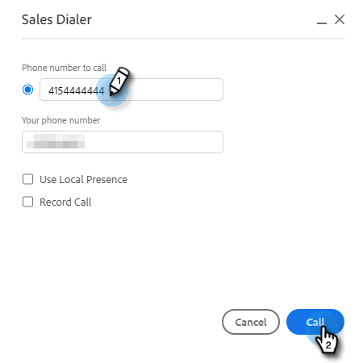

# Redenen voor oproepen {#call-reasons}

Sta uw verkoopteams toe om vraagredenen te selecteren wanneer het maken van vraag zodat kan uw team begrijpen waarom de vraag wordt gemaakt.

>[!NOTE]
>
>**vereiste toestemmingen Admin**

## De Redenen van de Vraag inschakelen {#enable-call-reasons}

1. Klik op het tandwielpictogram en selecteer **[!UICONTROL Settings]** .

   

1. Onder [!UICONTROL Admin Settings] selecteert u **[!UICONTROL Dialer]** .

   

1. Selecteer **[!UICONTROL Enable call reasons]**.

   

1. Kies uw gewenste behoefte van de vraagreden.

   

## Reden van de Vraag creëren {#create-call}

>[!NOTE]
>
>U kunt een maximum van 15 Redenen van de Vraag tot stand brengen.

1. Klik op het tandwielpictogram en selecteer **[!UICONTROL Settings]** .

   

1. Onder [!UICONTROL Admin Settings] selecteert u **[!UICONTROL Dialer]** .

   

1. Klik op **[!UICONTROL Manage call reasons]**.

   

1. Ga uw gewenste naam van de vraagreden in het tekstgebied in en klik **[!UICONTROL Add]**.

   

## Selecteer een Reden van de Vraag {#select-a-call-reason}

Zodra vraagredenen zijn toegelaten. De gebruikers kunnen één selecteren terwijl het maken van een vraag.

1. Klik de vraagknoop om dialer te lanceren.

   

1. Ga de vraaginformatie in dialer in en klik **[!UICONTROL Call]**.

   

1. Selecteer de vraagreden die het best de vraag beschrijft.

   

1. Beëindig de vraag.

   

1. Logboek de vraag.

   

>[!MORELIKETHIS]
>
>* [ Redenen van de Vraag van het Logboek en de Resultaten van de Vraag aan Salesforce ](/help/marketo/product-docs/marketo-sales-connect/phone/log-call-reasons-and-call-outcomes-to-salesforce.md)
>* [ Resultaten van de Vraag ](/help/marketo/product-docs/marketo-sales-connect/phone/call-outcomes.md)
