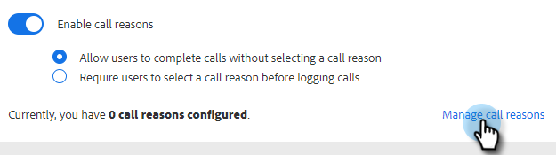

# Redenen voor oproepen {#call-reasons}

Sta uw verkoopteams toe om vraagredenen te selecteren wanneer het maken van vraag zodat kan uw team begrijpen waarom de vraag wordt gemaakt.

>[!NOTE]
>
>**Beheerdersmachtigingen vereist.**

## De Redenen van de Vraag inschakelen {#enable-call-reasons}

1. Klik op het tandwielpictogram en selecteer **Instellingen**.

   

1. Onder beheerinstellingen selecteert u **Dialer**.

   

1. Selecteren **De Redenen van de Vraag inschakelen**.

   

1. Kies uw gewenste behoefte van de vraagreden.

   

## Reden van de Vraag creëren {#create-call}

1. Klik op het tandwielpictogram en selecteer **Instellingen**.

   

1. Onder beheerinstellingen selecteert u **Dialer**.

   

1. Klikken **De Redenen van de Vraag beheren**.

   

1. Ga uw gewenste naam van de vraagreden in het tekstgebied in en klik **Toevoegen**.

   

## Selecteer een Reden van de Vraag {#select-a-call-reason}

Zodra vraagredenen zijn toegelaten. De gebruikers kunnen één selecteren terwijl het maken van een vraag.

1. Klik de vraagknoop om dialer te lanceren.

   PICC

1. Ga de vraaginformatie in dialer in.

   PICC

1. Klik vraag.

   PICC

1. Selecteer de vraagreden die het best de vraag beschrijft.

   PICC

1. Beëindig de vraag.

   PICC

1. Logboek de vraag.

   PICC

>[!MORELIKETHIS]
>
>* [De Redenen van de Vraag van het logboek en de Resultaten van de Vraag van Salesforce](/help/marketo/product-docs/marketo-sales-connect/phone/log-call-reasons-and-call-outcomes-to-salesforce.md)
>* [Resultaten bellen](/help/marketo/product-docs/marketo-sales-connect/phone/call-outcomes.md)

