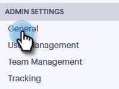

# Schakel Call Recording in {#enable-call-recording}

Als beheerder kunt u vraagopname voor uw [!DNL Sales Connect] vraag toelaten. Het registreren van de vraag van uw team kan een grote manier zijn om uw verkoopvertegenwoordigers op de beste roepende praktijken te coderen.

1. Klik op het pictogram Instellingen en selecteer **[!UICONTROL Settings]** .

   

1. Klik onder [!UICONTROL Admin Settings] op **[!UICONTROL General]** .

   

1. Schuif omlaag naar [!DNL Sales Connect] Telefooninstellingen en selecteer de schakeloptie **[!UICONTROL Enable call recording]** .

   

1. Als je verkopers de mogelijkheid wilt geven om het opnemen van oproepen voor zichzelf in of uit te schakelen, klik je op **[!UICONTROL Optional recording for all team members]** . Klik op **[!UICONTROL Record all calls]** als u alle aanroepen automatisch wilt laten opnemen.

   

>[!MORELIKETHIS]
>
>[ Twee Montages van de Toestemming van de Partij ](/help/marketo/product-docs/marketo-sales-connect/phone/two-party-consent-settings.md)
