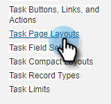

# Redenen van de Vraag van het logboek en de Resultaten van de Vraag van de Vraag [!DNL Salesforce] {#log-call-reasons-and-call-outcomes-to-salesforce}

Als u vraagresultaten en vraagredenen aan [!DNL Salesforce] voor het melden of zicht doeleinden wilt registreren, kunt u een gebied van de douaneactiviteit voor elk tot stand brengen. Voor elk veld moet een specifieke API-naam worden gebruikt (in [!DNL Salesforce] wordt &#39;&#39;veldnaam&#39;&#39; genoemd).

* De Naam van het Gebied van Resultaten van de vraag: mktosales_call_result
* De Naam van het Gebied van de Redenen van de vraag: mktosales_call_reason

Als u deze velden wilt gebruiken, moet u het veld eerst maken als een veld voor aangepaste activiteit. Als u deze zichtbaar wilt maken voor gebruikers, moet u deze toevoegen aan de pagina-indeling van het taakobject.

## [!DNL Salesforce] Klassiek {#salesforce-classic}

### Aangepast activiteitsveld maken in [!DNL Salesforce] Klassiek  {#create-custom-activity-field-in-salesforce-classic}

1. Klik in [!DNL Salesforce] op **[!UICONTROL Setup]** .

   

1. Typ &quot;Activiteiten&quot; in het vak Snel zoeken.

   

1. Klik op **[!UICONTROL Activity Custom Fields]**.

   

1. Klik op **[!UICONTROL New]**.

   

1. Selecteer het gegevenstype &quot;[!UICONTROL Text]&quot; en klik op **[!UICONTROL Next]** .

   

1. Geef het aangepaste veld de veldnaam zoals hierboven gedefinieerd. De veldlengte mag niet langer zijn dan 255 tekens. Het Etiket van het gebied zal het gebied zichtbaar aan uw verkoopteam zijn en kan worden aangepast om aan de behoeften van uw team te voldoen.

   

1. De overige instellingen zijn optioneel. Klik op **[!UICONTROL Next]** nadat u de configuratie hebt voltooid.

   

1. Selecteer de gewenste beveiligingsinstellingen op veldniveau voor dit veld en klik op **[!UICONTROL Next]** (de onderstaande afbeelding is slechts een voorbeeld).

   

   >[!NOTE]
   >
   >Zorg ervoor dat het aangepaste veld zichtbaar is voor het profiel dat uw [!DNL Sales Connect] -gebruikers gebruiken, en ook voor alle andere elementen die u wilt zien.

1. Selecteer welke paginalay-outs u het gebied aan wilt toevoegen en **[!UICONTROL Save]** klikken (facultatief, kunt u **[!UICONTROL Save & New]** klikken en het proces voor het gebied van de Reden van de Vraag herhalen).

   

### Aangepast activiteitenveld toevoegen aan taakpaginalayout in [!DNL Salesforce] Klassiek {#add-custom-activity-field-to-task-page-layout-in-salesforce-classic}

>[!NOTE]
>
>U hoeft deze stappen alleen uit te voeren als u in Stap 9 hierboven de gewenste paginalay-out niet hebt geselecteerd.

1. Klik in [!DNL Salesforce] op **[!UICONTROL Setup]** .

   

1. Typ &quot;Taak&quot; in het vak Snel zoeken.

   

1. Klik op **[!UICONTROL Task Page Layouts]**.

   

1. Klik op **[!UICONTROL Edit]** naast de indeling van de taakpagina waaraan u dit veld wilt toevoegen.

   

1. Sleep het veld naar het gewenste gedeelte van de taakpaginalay-out.

   

1. Klik op **[!UICONTROL Save]**.

   

## [!DNL Salesforce] Lightning {#salesforce-lightning}

### Veld voor aangepaste activiteit maken in [!DNL Salesforce] bliksemschicht {#create-custom-activity-field-in-salesforce-lightning}

1. Klik in [!DNL Salesforce] op het tandwielpictogram rechtsboven en selecteer **[!UICONTROL Setup]** .

   

1. Klik op **[!UICONTROL Object Manager]**.

   

1. Typ &quot;[!UICONTROL Activity]&quot; in het vak Snel zoeken.

   

1. Klik op het label **[!UICONTROL Activity]** .

   

1. Klik op **[!UICONTROL Fields & Relationships]**.

   

1. Klik op **[!UICONTROL New]**.

   

### Veld voor aangepaste activiteit toevoegen aan taakpaginalayout in [!DNL Salesforce] bliksemschicht {#add-custom-activity-field-to-task-page-layout-in-salesforce-lightning}

1. Klik in [!DNL Salesforce] op het tandwielpictogram rechtsboven en selecteer **[!UICONTROL Setup]** .

   

1. Klik op **[!UICONTROL Object Manager]**.

   

1. Typ &quot;[!UICONTROL Task]&quot; in het vak Snel zoeken.

   

1. Klik op het label **[!UICONTROL Task]** .

   

1. Klik op **[!UICONTROL Page Layouts]**.

   

1. Klik op de taakpaginalay-out waaraan u dit veld wilt toevoegen.

   

1. Sleep het veld naar het gewenste gedeelte van de taakpaginalay-out.

   

1. Klik op **[!UICONTROL Save]**.

   

>[!MORELIKETHIS]
>
>[ installeer de Gebieden van de Gebeurtenis van de Verkoop Connect op de Geschiedenis van de Activiteit ](/help/marketo/product-docs/marketo-sales-connect/crm/salesforce-customization/install-sales-connect-event-fields-on-activity-history.md)
