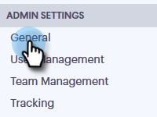
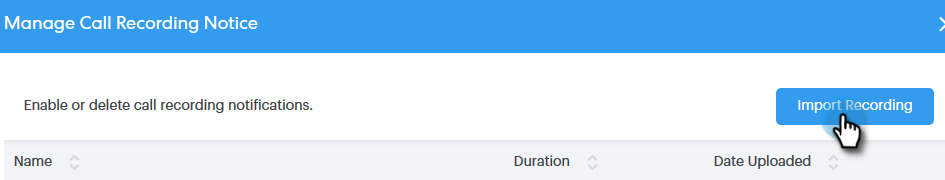

# Instellingen voor tweeledige toestemming {#two-party-consent-settings}

Om naleving van de de toestemmingswetten van twee partijen van de V.S. te verzekeren wanneer het registreren van vraag, als Admin kunt u een vooraf opgenomen bericht van uw keus toelaten om aan het begin van uw vraag te spelen wanneer het wordt geregistreerd.

>[!PREREQUISITES]
>
>Alvorens de stappen hieronder te volgen, moet u vraagopname [&#x200B; eerst &#x200B;](/help/marketo/product-docs/marketo-sales-connect/phone/enable-call-recording.md) toelaten.

1. Klik op het pictogram Instellingen en selecteer **[!UICONTROL Settings]** .

   

1. Klik onder [!UICONTROL Admin Settings] op **[!UICONTROL General]** .

   

1. Schuif omlaag naar [!UICONTROL Sales Connect Phone Settings] en klik op **[!UICONTROL Manage recording notice]** .

   

1. Klik op **[!UICONTROL Import Recording]**.

   

   >[!NOTE]
   >
   >Alleen Wav- en MP3-bestanden worden ondersteund. U kunt een bestand niet langer dan 30 seconden uploaden.

1. Selecteer het gewenste audiobestand op de vaste schijf.

   

1. Nadat het uploaden is voltooid, selecteert u de gegevens (drie punten) in het bestandsbeheer en klikt u op **[!UICONTROL Select as Consent Notice]** . Klik op **[!UICONTROL OK]** als u klaar bent.

   

1. Klik knevel om het geselecteerde bericht toe te laten aan het begin van uw geregistreerde vraag worden gespeeld.

   
