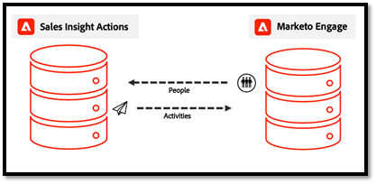

# Veelgestelde vragen over gegevenssynchronisatie voor handelingen {#actions-data-sync-faq}

Met de gegevensunificatie-veldsync voor [!DNL Sales Insight Actions] kan het systeem persoongegevens uit uw Marketo Engage-database ophalen in uw [!DNL Sales Insight Actions] -database.

Dit biedt actuele gegevens over personen in de [!DNL Sales Insight Actions] -webtoepassing en stelt het systeem in staat unieke id&#39;s te verzamelen voor corresponderende records in Marketo en records voor leads/contact/account/opportunity in [!DNL Salesforce] , zodat er naar records kan worden verwezen voor loggegevens.

Deze synchronisatie kan worden ingeschakeld op het tabblad [!DNL Sales Insight Actions] Configuratie in de sectie Beheer van Marketo Engage. Voor meer informatiecontrole [ leidt de Synchronisatie van Gegevens ](/help/marketo/product-docs/marketo-sales-insight/actions/getting-started/sales-insight-actions-admin-setup-guide.md#initiate-data-sync) in.

Het diagram hierboven toont hoe de menselijke activiteit en de taakgegevens tussen systemen kunnen synchroniseren. Een paar dingen:

* Personenrecords worden vanuit Marketo Engage gesynchroniseerd met [!DNL Sales Insight Actions] , waardoor Marketo Engage de bron van de waarheid is voor [!DNL Sales Insight Actions] personengegevens
* Zowel hebben Marketo Engage als [!DNL Sales Insight Actions] [ een mechanisme ](/help/marketo/product-docs/marketo-sales-insight/actions/email/unsubscribes/syncing-unsubscribes-with-salesforce.md) voor het verzamelen van en het synchroniseren van unsubscribe status aan [!DNL Salesforce]
* De status van Unsubscribe synchroniseert niet van de Acties van de Verkoop aan Marketo Engage, maar [!DNL Sales Insight Actions] kan worden gevormd om de status van Marketo te controleren Unsubscribe van mensen alvorens verkopers toe te staan om een e-mail met [ Marketo te verzenden Unsubscribe Controle ](/help/marketo/product-docs/marketo-sales-insight/actions/email/unsubscribes/marketo-unsubscribe-check.md).

Hieronder volgen enkele veelgestelde vragen over de werking van het synchroniseren van gegevens.

## Aan welke leads/contactpersonen wordt [!DNL Sales Insight Actions] gesynchroniseerd? {#what-lead-contacts-are-synced}

De leiders en de contacten die een verkoopeigenaar hebben aan hen wordt toegewezen zullen in de Acties van de Verkoop worden gesynchroniseerd.

U kunt zien of heeft een lood/contact een verkoopeigenaar in [!DNL Salesforce] door het standaardeigenaargebied te bekijken dat bestaat.

De eigenaar van de verkoop hoeft niet de synchronisatiegebruiker van Marketo of een specifieke [!DNL Salesforce] of verkoopgebruiker te zijn. Het enige wat we nodig hebben, is dat een gebruiker wordt vermeld in het veld Eigenaar lead en Eigenaar contactpersoon in [!DNL Salesforce] , zodat we deze kunnen identificeren als een verkooplead en kunnen synchroniseren met [!DNL Sales Insight Actions] . Alle updates van de velden waarmee we synchroniseren, worden ook gedetecteerd en bijgewerkt in [!DNL Sales Insight Actions] .

## Waar worden de activiteitsgegevens die worden weergegeven in het Smart Grid van Sales Insight vandaan gehaald? {#where-does-the-activity-data-get-sourced-from}

De activiteitsgegevens, zoals email, call, interessant moment en web, zijn allemaal afkomstig uit de Marketo Engage-database. Het Smart Grid van de Verkoop Insight richt een verzoek aan de instantie van Marketo Engage om dit terug te winnen telkens als een verkoopgebruiker het paneel van Insight van de Verkoop laadt.

Om ervoor te zorgen dat alle activiteitsgegevens kunnen worden opgehaald uit Marketo Engage, synchroniseert [!DNL Sales Insight Actions] alle activiteitsgegevens naar Marketo Engage.

## Welke velden hebben betrekking op personen die synchroniseren van Marketo Engage naar [!DNL Sales Insight Actions]? {#what-fields-sync}

Er zijn 11 velden die van Marketo Engage naar [!DNL Sales Insight Actions] worden gesynchroniseerd:

* Voornaam
* Achternaam
* [!DNL Salesforce] contact-id
* [!DNL Salesforce] lead-id
* [!DNL Salesforce] account-id
* [!DNL Salesforce] opportuniteid
* Marketo-id
* Bedrijf
* Titel
* E-mail
* Telefoonnummer
* [!DNL Linkedin] URL
* Bron

## Zijn de velden die synchroniseren tussen Marketo Engage en [!DNL Sales Insight Actions] configureerbaar? {#are-the-fields-that-sync-configurable}

Het configureren van welke Marketo Engage-velden worden gesynchroniseerd met [!DNL Sales Insight Actions] is niet beschikbaar en de mogelijkheid om velden toe te wijzen is ook niet beschikbaar. Bij de synchronisatie vanuit Marketo worden standaard Marketo-velden automatisch toegewezen aan standaardvelden in je Verkoopactie-exemplaar.

## Waarom heeft [!DNL Sales Insight Actions] een eigen database? {#why-does-actions-have-its-own-database}

[!DNL Sales Insight Actions] beschikt over een eigen webtoepassing met een toegewijde persoon- en activiteitendatabase voor een geoptimaliseerde werkruimte die is ontworpen en gemaakt voor verkoopteams. Zo kunnen verkoopmanagers en verkopers over voldoende ruimte beschikken om hun servicestrategie uit te werken en te beheren   zonder toegang of privileges toe te kennen aan de primaire Marketo Engage-werkruimte, die is geoptimaliseerd voor marketingspecialisten.

## Hoe worden duplicaten afgehandeld? {#how-are-duplicates-handled}

Uw database met verkoopacties bevat een kopie van de gekwalificeerde personen (leads/contacten met een eigenaar van de verkoop) die in uw Marketo Engage-database aanwezig zijn. Dit betekent dat als er twee records zijn met hetzelfde e-mailadres dat in Marketo is gemaakt, er een dubbele record wordt gemaakt in Verkoopacties.

## Hoe lang duurt het voordat de eerste synchronisatie is voltooid? {#how-long-initial-sync}

Het eerste proces voor het synchroniseren van al uw gegevens van de verkooplood in een nieuwe [!DNL Sales Insight Actions] instantie zal typisch mensen bij ongeveer 1.000 om de 1-2 minuten verwerken. Dit is slechts een schatting en kan variëren.

Zodra de eerste synchronisatie plaatsvindt en al uw verkoopinstructies zijn ingevuld in uw [!DNL Sales Insight Actions] -webtoepassingsinstantie, wordt er een incrementele synchronisatie uitgevoerd telkens wanneer een update wordt uitgevoerd naar een van de ondersteunde velden die worden gesynchroniseerd.

## Kunnen [!DNL Sales Insight Actions] gebruikers personengegevens uit het Web-app van Acties uitgeven? {#can-actions-users-edit-people-data}

Nee, de mogelijkheid om records voor personen te maken en te bewerken in Handelingen is niet beschikbaar voor zowel gebruikers als beheerders van de webapp Handelingen. Het maken en bewerken van personen moet in [!DNL Salesforce] of Marketo Engage gebeuren. [!DNL Sales Insight Actions] gebruikt Marketo als de bron van de waarheid voor gegevens van personen door voortdurend nieuwe gegevens te synchroniseren. Als een persoon in Marketo wordt bijgewerkt of gemaakt via een workflow in Marketo of wordt gesynchroniseerd via [!DNL Salesforce] , worden deze updates doorgegeven aan de [!DNL Sales Insight Actions] web-app-database.

## Meld je verkoopactiviteiten aan bij Marketo? {#do-sales-activities-log-to-marketo}

Ja, de activiteiten van de verkoopovereenkomst zullen aan Marketo als inheemse activiteiten registreren. Deze activiteiten omvatten ook inheemse filters die met beperkingen kunnen worden gebruikt om lood te richten die op de attributen van de verkoopactiviteit wordt gebaseerd.

Hieronder volgt een lijst van de activiteiten die aan Marketo registreren:

* Verkoop-e-mail verzenden
* Verkoopbericht openen
* Klik op E-mail verkoop
* Reageerd op e-mail over verkoop
* Verkoop-e-mail teruggestuurd
* Verkoopoproep ontvangen
* Toevoegen aan verkoopcampagne
* Verwijderd uit verkoopcampagne

## Meld u aan bij verkoopactiviteiten naar [!DNL Salesforce]? {#do-sales-activities-log-to-salesforce}

Ja, de activiteiten van de verkoopovereenkomst zullen aan [!DNL Salesforce] als inheemse taken registreren. Deze taken kunnen vervolgens worden gebruikt in [!DNL Salesforce] -rapporten aan power team dashboards die verkoopactiviteiten volgen.

Met [!DNL Sales Insight Actions] kunnen beheerders configureren welke verkoopactiviteiten worden aangemeld bij [!DNL Salesforce] . Deze activiteiten omvatten e-mails, oproepen en open herinneringstaken.

In het bovenstaande diagram ziet u welke informatie wordt aangemeld bij [!DNL Salesforce] . De activiteiten zoals e-mail en de vraag worden geregistreerd aan [!DNL Salesforce] in a [ unidirectionele synchronisatie ](/help/marketo/product-docs/marketo-sales-insight/actions/crm/salesforce-integration/salesforce-sync-settings.md). [ Unsubscribes ](/help/marketo/product-docs/marketo-sales-insight/actions/email/unsubscribes/syncing-unsubscribes-with-salesforce.md) en [ de Taken van de Herinnering ](/help/marketo/product-docs/marketo-sales-insight/actions/tasks/reminder-task-sync-with-salesforce.md) worden gehouden bijgewerkt met een 2-wegsynchronisatie. Elk van deze gegevenssyncs is configureerbaar vanuit de [!DNL Sales Insight Actions] web app interface.

>[!MORELIKETHIS]
>
>* [ synchroniserend Unsubscribes met  [!DNL Salesforce]](/help/marketo/product-docs/marketo-sales-insight/actions/email/unsubscribes/syncing-unsubscribes-with-salesforce.md)
>* [ Marketo Unsubscribe Controle ](/help/marketo/product-docs/marketo-sales-insight/actions/email/unsubscribes/marketo-unsubscribe-check.md)
>* [[!DNL Salesforce]  de Montages van de Synchronisatie ](/help/marketo/product-docs/marketo-sales-insight/actions/crm/salesforce-integration/salesforce-sync-settings.md)
>* [ de Synchronisatie van de Taak van de herinnering met  [!DNL Salesforce]](/help/marketo/product-docs/marketo-sales-insight/actions/tasks/reminder-task-sync-with-salesforce.md)
>* [ initieert de Synchronisatie van Gegevens ](/help/marketo/product-docs/marketo-sales-insight/actions/getting-started/sales-insight-actions-admin-setup-guide.md#initiate-data-sync)
