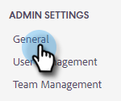

# Geblokkeerde domeinen {#blocked-domains}

Help uw verkoopteam succes te behalen door te voorkomen dat zij per ongeluk concurrenten, bekende spamvallen of andere domeinen waarmee u geen contact wilt opnemen per e-mail verzenden.

>[!NOTE]
>
>**Beheerdersmachtigingen vereist**

1. Klik in de webtoepassing op het tandwielpictogram en selecteer **Instellingen**.

   

1. Klik onder Beheerinstellingen op **Algemeen**.

   

1. Ga het domein in u geblokkeerd wilt en **Blokkeer Domein**.

   

   >[!NOTE]
   >
   >E-mailberichten die deel uitmaken van een groepse e-mailverzending die mislukt omdat ze naar een geblokkeerd e-maildomein zijn verzonden, mislukken op de achtergrond en worden niet weergegeven in de mislukte e-mailmap.
