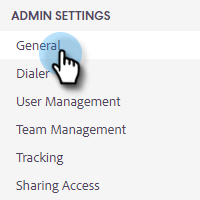

# Inhoud vergrendelen {#content-lockdown}

Als u de inhoud vergrendelt, voorkomt u dat gebruikers van andere leveranciers dan Admin sjablonen en/of campagnes bewerken. Gebruikers kunnen geen inhoud delen, klonen, bewerken of verwijderen. Ze kunnen ook geen sjablonen archiveren.

>[!NOTE]
>
>Gebruikers kunnen de inhoud van een e-mail nog steeds bewerken op het moment dat ze een campagne verzenden of starten.

1. Klik op het tandwielpictogram en selecteer **[!UICONTROL Settings]** .

   

1. Klik onder [!UICONTROL Admin Settings] op **[!UICONTROL General]** .

   

1. Omlaag schuiven naar [!UICONTROL Content Lockdown] . Als u een van de schuifregelaars inschakelt, wordt de mogelijkheid voor uw teamleden om sjablonen en/of campagnes te maken/bewerken, uitgeschakeld.

   
