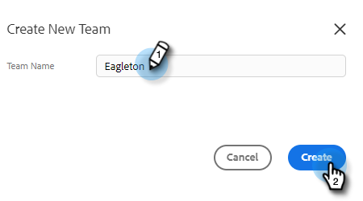

# Een team maken {#create-a-team}

Door een team te maken, kunt u een groep gebruikers samenstellen waarmee inhoud kan worden gedeeld en rapporten kunnen worden gefilterd.

## Een team maken {#create-a-team}

1. In de [webtoepassing](https://toutapp.com/login), klikt u op het tandwielpictogram en selecteert u **Instellingen**.

   

1. Selecteer onder Beheerinstellingen de optie **Teambeheer**.

   

1. Klik naast Teams op de knop **+** pictogram.

   

1. Voer een teamnaam in en klik op **Maken**.

   

>[!NOTE]
>
>U kunt nu sjablonen, campagnes en groepen delen met dat team.

## Personen aan een team toevoegen {#add-people-to-a-team}

1. Stilstaand in Teambeheer, selecteert u **Alle leden**.

   

1. Zoek de gebruikers die u aan uw team wilt toevoegen en schakel het selectievakje in.

   

1. Klikken **Toevoegen aan teams**.

   

1. Klik op de vervolgkeuzelijst en selecteer de gewenste team(s).

   

1. Klikken **Toevoegen** wanneer gereed.

   
