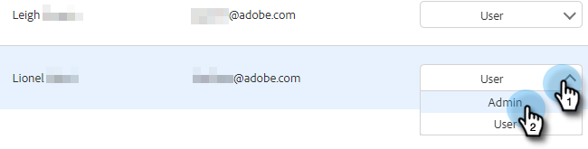

# Gebruikers en beheerders uitnodigen {#invite-users-and-admins}

Het toevoegen van gebruikers of beheerders is snel en eenvoudig!

## Gebruikers uitnodigen {#invite-users}

1. Klik op het tandwielpictogram en selecteer **Instellingen**.

   

1. Selecteer onder Beheerinstellingen de optie **Gebruikersbeheer**.

   

1. Klik op de knop **Handelingen** en selecteert u **Gebruikers uitnodigen**.

   

   >[!NOTE]
   >
   >U kunt ook **Gebruikers uitnodigen via CSV** als u ze allemaal in een spreadsheet hebt opgenomen.

1. Voer de e-mailadressen in van de personen die u wilt toevoegen.

   

1. OPTIONELE STAP: Voeg de gebruiker(s) toe aan een team waarvan ze deel moeten uitmaken. Als u dit deel overslaat, zullen alle nieuwe leden aan het Iedereen team worden toegevoegd.

   

   >[!NOTE]
   >
   >[Meer informatie over teams](/help/marketo/product-docs/marketo-sales-insight/actions/admin/creating-a-team.md).

1. Selecteer de Marketo-werkruimte waaraan u de nieuwe gebruiker(s) wilt toevoegen. Als u maar één werkruimte hebt, ziet u Standaard als optie. Klikken **Uitnodigen**.

   

1. Klikken **OK**.

   

## Een gebruiker en beheerder maken {#make-a-user-an-admin}

>[!NOTE]
>
>**Beheerdersmachtigingen vereist**

Ga als volgt te werk om een bestaande gebruiker tot Admin te maken.

1. Klik op het tandwielpictogram en selecteer **Instellingen**.

   

1. Selecteer onder Beheerinstellingen de optie **Gebruikersbeheer**.

   

1. Zoek de gebruiker die u een beheerder wilt maken, klik op de vervolgkeuzelijst Rol en selecteer **Beheer**.

   

Eenvoudig zo!
