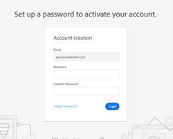

# Aanmeldingsbeheerinstellingen {#login-management-settings}

Met de instellingen voor Aanmeldingsbeheer kunnen beheerders de voorkeuren voor verificatie instellen voor gebruikers van Handelingen van Verkoopmanager Insight op algemeen niveau.

>[!NOTE]
>
>Standaard wordt de optie [!UICONTROL Salesforce Only] geselecteerd voor [!DNL Sales Insight Actions] -instanties. Wij adviseren dit het plaatsen zodat de gebruikers [ auto-login ](/help/marketo/product-docs/marketo-sales-insight/actions/admin/auto-login-from-salesforce.md) van [!DNL Salesforce] kunnen.

## Aanmeldingsbeheerinstellingen bijwerken {#update-login-management-settings}

>[!NOTE]
>
>**vereiste toestemmingen Admin**

Voer de volgende stappen uit om uw voorkeuren voor aanmeldingsbeheer bij te werken.

1. Klik op het tandwielpictogram en selecteer **[!UICONTROL Settings]** .

   

1. Klik onder [!UICONTROL Admin Settings] op **[!UICONTROL General]** .

   

1. Schuif omlaag naar [!UICONTROL Login Management] -kaart en selecteer de gewenste instelling (in dit voorbeeld kiest u Alleen Salesforce). Klik op **[!UICONTROL Save]** als u klaar bent.

   

## Alleen Salesforce - Veelgestelde vragen {#salesforce-only-faq}

Alleen Salesforce betekent dat gebruikers zich alleen kunnen verifiëren voor gebruik van [!DNL Sales Insight Actions] met [!DNL Salesforce] . Dit is de standaardselectie voor [!DNL Sales Insight Actions] -instanties en wordt aanbevolen vanwege de mogelijkheid voor gebruikers om zich naadloos te laten verifiëren zonder een gebruikersnaam en wachtwoord te hoeven beheren.

### Hoe activeert een nieuwe gebruiker aan mijn instantie zijn rekening wanneer &quot;[!UICONTROL Salesforce Only]&quot;wordt geselecteerd? {#activate-when-salesforce-only-is-selected}

Nadat u op de knop **[!UICONTROL Getting Started]** in de uitnodigingse-mail hebt geklikt, worden nieuwe gebruikers verzonden naar een scherm voor accountactivering waar ze hun Salesforce-exemplaar moeten aansluiten om hun [!DNL Sales Insight Actions] -account te activeren.

### Welke authentificatiemethodes zijn mijn gebruikers toegestaan om met voor authentiek te verklaren wanneer &quot;[!UICONTROL Salesforce Only]&quot;wordt geselecteerd? {#what-authentication-methods}

Wanneer gebruikers naar ons aanmeldingsscherm navigeren, voeren ze eerst hun e-mailadres in. Vervolgens klikken ze op de knop Salesforce One Click [!UICONTROL Login] , waar ze zich kunnen verifiëren met de Salesforce-account waarbij ze zich zijn aangemeld.

>[!NOTE]
>
>Dit geldt alleen voor gebruikers die rechtstreeks naar het aanmeldingsscherm navigeren. De gebruikers die tot Acties van [!DNL Salesforce] toegang hebben zullen met [ auto-login ](/help/marketo/product-docs/marketo-sales-insight/actions/admin/auto-login-from-salesforce.md) worden het programma geopend.

### Hoe wordt gebruikersverificatie verwerkt voor handelingen wanneer een gebruiker toegang krijgt tot een functie Handelingen in Salesforce en &quot;Alleen Salesforce&quot; is geselecteerd? {#how-is-user-authentication-handled}

Wanneer een gebruiker op een van de acties (Vraag, E-mail, Campagne, Taken, de Lijst van de Campagne enz.) klikt, gebruiken wij hun authentificatie van SFDC om hen automatisch in hun [!DNL Sales Insight Actions] rekening te registreren. Wij roepen deze authentificatie [ auto-login ](/help/marketo/product-docs/marketo-sales-insight/actions/admin/auto-login-from-salesforce.md).

## Veelgestelde vragen over alle aanmeldingsmethoden {#all-login-methods-faq}

### Hoe activeert een nieuwe gebruiker van mijn instantie zijn account wanneer &quot;Alle aanmeldingsmethoden&quot; is geselecteerd? {#activate-when-all-login-methods-is-selected}

Wanneer een nieuwe gebruiker wordt uitgenodigd voor een exemplaar, ontvangt hij een e-mail over activering van zijn account. Zij zullen op de knoop klikken die &quot;krijgen Begonnen&quot;zegt die dan hen aan een pagina zal brengen die hen vraagt om een wachtwoord tot stand te brengen en te bevestigen. Zodra dit wordt gecreeerd zal hun rekening worden geactiveerd en zij zullen door het onboarding werkschema worden genomen.

### Wat zijn de gebruikers van mijn instantie toegestaan om binnen te login met wanneer &quot;[!UICONTROL All Login Methods]&quot;wordt geselecteerd? {#what-are-users-allowed-to-log-in-with-all-login}

Als gebruikers onze aanmeldingspagina gebruiken, moeten ze eerst hun e-mailadres invoeren. Vervolgens worden ze naar een pagina verzonden die alle aanmeldingsopties (gebruikersnaam/wachtwoord, SFDC, Gmail, SSO) bevat waarmee ze kunnen worden geverifieerd.
