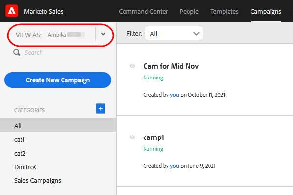

# Toegangsgegevens gebruiker {#user-access-details}

Waartot hebben Admins en niet-Admins toegang?

## Beheerdersmachtigingen {#admin-user-permissions}

Admins kan [ alle malplaatjes ](/help/marketo/product-docs/marketo-sales-connect/templates/view-template-list-as-another-user.md) bekijken.

Admins kan [ alle campagnes ](/help/marketo/product-docs/marketo-sales-connect/campaigns/view-campaigns-list-as-another-user.md) bekijken.

Beheerders kunnen alle e-mailactiviteiten weergeven.

Admins kunnen alle mensen op een lopende campagne zien.

Beheerders kunnen gebruikerscampagnes en campagnecategorieën weergeven in de vervolgkeuzelijst [!UICONTROL View As] .

Beheerders kunnen campagnes namens gebruikers stoppen.

## Rechten van gebruikers die geen beheerder zijn {#non-admin-user-permissions}

* Analyse:

   * Gebruikers kunnen teamanalyses bekijken
   * De gebruikers kunnen in enkel de teams boren zij tot behoren
   * Gebruikers kunnen hun eigen analyses bekijken

* [!UICONTROL People] Pagina:

   * Gebruikers kunnen groepen met iedereen delen
   * Gebruikers kunnen groepen delen met alleen de teams waartoe zij behoren
   * De gebruikers zullen zicht aan alle mensen in uw gegevensbestand van Acties hebben
   * Wanneer een gebruiker wordt geschrapt, brengen hun gedeelde contacten eigendom aan HoofdAdmin over die de gebruiker schrapte

* [!UICONTROL Team] Beheerpagina:

   * Kan niet weergeven

* [!UICONTROL Templates] Pagina:

   * Gebruikers kunnen sjablonen met iedereen delen
   * Gebruikers kunnen sjablonen delen in categorieën die hun beheerders toestaan
   * Wanneer een gebruiker uit een team wordt verwijderd, worden hun sjablonen niet gedeeld met dat team
   * Wanneer een gebruiker uit een team wordt verwijderd, wordt de eigendom van de sjablonen overgedragen aan de hoofdbeheerder die de gebruiker heeft verwijderd
