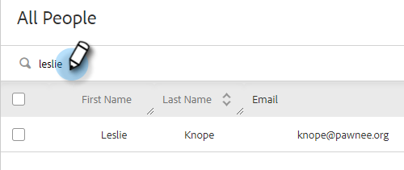

# Toevoegen aan marketingcampagne {#add-to-marketing-campaign}

>[!PREREQUISITES]
>
>[ maak een Campagne zichtbaar aan de Gebruikers van de Verkoop ](/help/marketo/product-docs/marketo-sales-insight/actions/marketo/make-a-marketing-campaign-visible-in-sales-insight-actions.md)

## Personen toevoegen aan een campagne {#add-individuals-to-a-campaign}

>[!NOTE]
>
>Als u iemand vanuit Sales Connect aan een Marketo-campagne wilt toevoegen, moet Sales Connect de Marketo lead-id van die persoon hebben.

1. Klik het **Lusje van Mensen**.

   

1. Zoek de contactpersoon of contactpersonen die u wilt toevoegen.

   

1. Klik checkbox om uw contact(en) te selecteren en **te klikken voegt Geselecteerd aan Campagne** toe.

   

1. STAP HIER

   

1. Aangezien u aan een campagne van de Marketing toevoegt, sla het selecteren van een &quot;van&quot;adres over. U kunt er echter voor kiezen om meer contactpersonen toe te voegen. Klik op Individuen en typ deze in als u dit wilt. Klik **daarna** wanneer gedaan.

   

1. Klik **op de markt brengende Campagne**.

PICC

1. Klik op de vervolgkeuzelijst Werkruimten en kies de werkruimte die de campagne bevat waaraan de groep moet worden toegevoegd.

PICC

>[!NOTE]
>
>Als u de gewenste werkruimte niet ziet, controleert u of de beheerdersvoorzieningen aanwezig zijn via de pagina Marketo Team Access.

1. Selecteer de gewenste campagne en klik **daarna**.

PICC

1. U wordt getoond de contacten die kwalificeren. Klik **Begin** om hen toe te voegen.

PICC

## Een groep toevoegen aan een campagne {#add-a-group-to-a-campaign}

1. Klik het **Lusje van Mensen**.

PICC

1. Selecteer onder Mijn groepen de groep die u aan een campagne wilt toevoegen.

PICC

1. Klik **toevoegen Groep aan Campagne**.

PICC

1. Aangezien u aan een campagne van de Marketing toevoegt, sla het selecteren van een &quot;van&quot;adres over. U kunt er echter voor kiezen om meer contactpersonen toe te voegen. Klik op Individuen en typ deze in als u dit wilt. Klik **daarna** wanneer gedaan.

PICC

1. Selecteer **de Marketing Campagne**.

PICC

>[!NOTE]
>
>Als u iemand vanuit Sales Connect aan een Marketo-campagne wilt toevoegen, moet Sales Connect de Marketo lead-id van die persoon hebben.

1. Klik op de vervolgkeuzelijst Werkruimten en kies de werkruimte die de campagne bevat waaraan de groep moet worden toegevoegd.

PICC

>[!NOTE]
>
>Als u de gewenste werkruimte niet ziet, controleert u of de beheerdersvoorzieningen aanwezig zijn via de pagina Marketo Team Access.

1. Selecteer de gewenste campagne en klik **daarna**.

PICC

1. U wordt getoond de contacten die kwalificeren. Klik **Begin** om hen toe te voegen.

PICC
