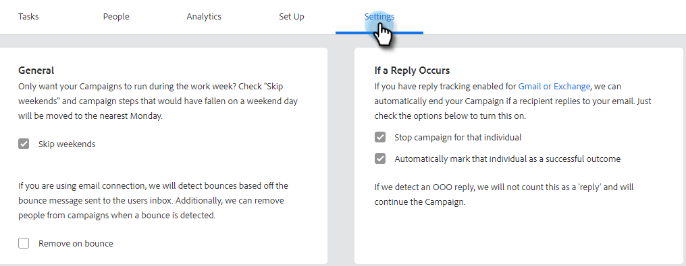

# Een verkoopcampagne maken {#create-a-sales-campaign}

De Campagnes van de verkoop zijn een reeks multikanaalsstappen met inbegrip van: e-mail, telefoongesprekken, InMail, en douanetaken. Zij staan u toe om uw mededelingen met uw potentieel en bestaande klanten te stroomlijnen.

Met verkoopcampagnes kunt u:

* **organiseer**: Stroomlijn al uw outreach activiteiten in één plaats voor efficiënte uitvoering.
* **Schaal**: Plan al uw outreach-inspanningen zodat kunt u uw inspanningen schalen, handwerk minimaliseren, en personaliseren zo veel aangezien u nodig hebt.
* **Maatregel**: Houd het succes van al uw e-mails en taken op één plaats bij terwijl het registreren van hen in [!DNL Salesforce] automatisch. Door te weten wat resoneert en tot resultaten leidt, kunt u constant uw resultaten testen en verbeteren.

Hoe zet je een verkoopcampagne op?

1. Klik op de tab **[!UICONTROL Campaigns]** .

   

1. Selecteer een categorie en klik op **[!UICONTROL Create New Campaign]** .

   

   >[!NOTE]
   >
   >Maak een nieuwe categorie door op **+** naast **[!UICONTROL Categories]** te klikken.

1. De gekozen rubriek wordt geselecteerd. Als u van mening verandert, klikt u op de vervolgkeuzelijst en selecteert u een andere. Klik op **[!UICONTROL Continue]** als u klaar bent.

   

1. Klik op **[!UICONTROL Add a Step]**.

   

1. Kies tussen: E-mail, Vraag, InMail, of de Taak van de Douane. In dit voorbeeld kiezen we E-mail.

   

1. Wanneer u [&#x200B; met uw e-mail &#x200B;](/help/marketo/product-docs/marketo-sales-insight/actions/campaigns/sales-campaign-step-types-and-reminder-tasks.md#email){target="_blank"} wordt gedaan, klik **[!UICONTROL Add]**.

   

1. Nadat u uw eerste dag en stap creeert, activeert de &quot;[!UICONTROL Add a Day]&quot;knoop en u kunt zo vele dagen en stappen toevoegen aangezien uw verkoopproces vereist.

   

   >[!NOTE]
   >
   >&quot;Dagen&quot; zijn niet het aantal dagen tussen handelingen, maar de dag binnen de reeks. Bijvoorbeeld, als uw Campagne van de Verkoop 7 dagen gaat duren, betekent het ingaan &quot;3&quot;de actie op dag 3 van 7 zal gaan, **niet** 3 dagen later.

1. Zorg ervoor u het plannen en antwoordopties aanpassen, zoals het overslaan van weekends (wat geweldig is) door het **[!UICONTROL Settings]Lusje** voor uw Campagne van de Verkoop te bezoeken.

   

Nu is het tijd om mensen toe te voegen!

>[!MORELIKETHIS]
>
>* {de Types van Stap van de Campagne van 0} Verkoop en de Taken van de Herinnering [&#128279;](/help/marketo/product-docs/marketo-sales-insight/actions/campaigns/sales-campaign-step-types-and-reminder-tasks.md){target="_blank"}
>* [&#x200B; de Montages van de Campagne van de Verkoop &#x200B;](/help/marketo/product-docs/marketo-sales-insight/actions/campaigns/sales-campaign-settings.md){target="_blank"}
