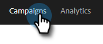
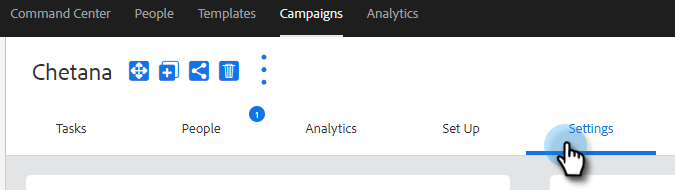

# Instellingen verkoopcampagne {#sales-campaign-settings}

Met de sectie met de instellingen voor verkoopcampagne kunt u een specifieke verkoopcampagne configureren, zodat deze optimaal aansluit bij de gebruiksgevallen van uw team voor die verkoopcampagne.

## Weekends overslaan {#skip-weekends}

Schakel overslaan in weekends in, zodat alle stappen die op een weekenddag (zaterdag of zondag) zouden zijn gevallen, worden verplaatst naar maandag.

>[!NOTE]
>
>Als [!UICONTROL Skip Weekends] is ingeschakeld, worden e-mailberichten gepland op basis van een week van 5 dagen. Dit betekent dat wanneer een stap is gepland, weekends worden genegeerd als dagen.

1. Klik op **[!UICONTROL Campaigns]**.

   

1. Kies de gewenste verkoopcampagne.

   

1. Klik op de tab **[!UICONTROL Settings]** .

   

1. Schakel het selectievakje **[!UICONTROL Skip Weekends]** in.

   

## Verwijderen bij stuiteren {#remove-on-bounce}

Als u een e-mailverbinding gebruikt, worden er stuiteringen gevonden op basis van het stuiteringsbericht dat naar de gebruikers in het Postvak IN wordt verzonden. Bovendien, kunnen wij mensen uit de Campagnes van de Verkoop verwijderen wanneer een stuit wordt ontdekt.

1. Klik op **[!UICONTROL Campaigns]**.

   

1. Kies de gewenste verkoopcampagne.

   

1. Klik op de tab **[!UICONTROL Settings]** .

   

1. Schakel het selectievakje **[!UICONTROL Remove on Bounce]** in.

   

## Als een reactie optreedt {#if-a-reply-occurs}

Als voor Gmail of [!DNL Exchange] de functie voor het bijhouden van antwoorden is ingeschakeld, kunnen we uw verkoopcampagne automatisch beëindigen als een ontvanger op uw e-mail reageert.

1. Klik op **[!UICONTROL Campaigns]**.

   

1. Kies de gewenste verkoopcampagne.

   

1. Klik op de tab **[!UICONTROL Settings]** .

   

1. Maak onder **[!UICONTROL If a Reply Occurs]** de gewenste selectie(s).

   

>[!MORELIKETHIS]
>
>* [ creeer een Campagne van de Verkoop ](/help/marketo/product-docs/marketo-sales-insight/actions/campaigns/create-a-sales-campaign.md){target="_blank"}
>* [ het Begrip van de Campagne van de Verkoop verzendt Opties voor E-mailstappen ](/help/marketo/product-docs/marketo-sales-insight/actions/campaigns/understanding-sales-campaign-send-options-for-email-steps.md){target="_blank"}
>* {de Types van Stap van de Campagne van 0} Verkoop en de Taken van de Herinnering [&#128279;](/help/marketo/product-docs/marketo-sales-insight/actions/campaigns/sales-campaign-step-types-and-reminder-tasks.md){target="_blank"}
