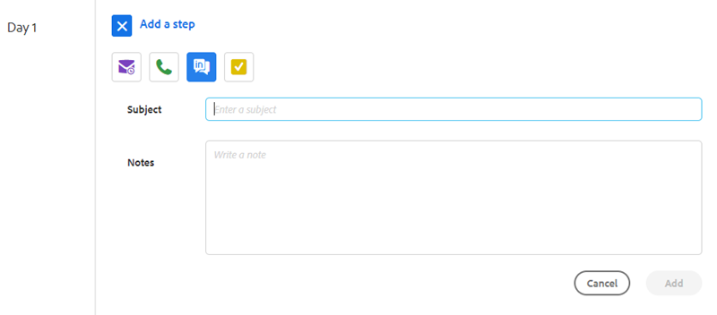
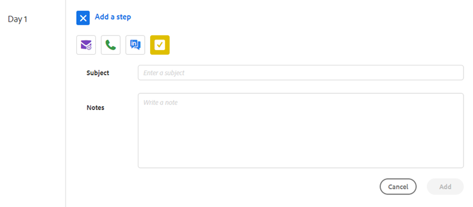

# Typen stappen en herinneringstaken voor verkoopcampagne {#sales-campaign-step-types-and-reminder-tasks}

## Typen stappen verkoopcampagne {#sales-campaign-step-types}

Wanneer u een stap toevoegt aan uw verkoopcampagne, hebt u vier opties.

### E-mail {#email}

Stel een nieuw e-mailbericht samen of gebruik een bestaande sjabloon.

| **[!UICONTROL Use a Template]** | Selecteer een van uw bestaande sjablonen |
|---|---|
| **[!UICONTROL Save as Template]** | E-mail opslaan die u net hebt samengesteld als een nieuwe sjabloon |
| **voeg Inhoud** toe | Upload een bestand naar onze server en ontvang een URL (die naar de inhoud verwijst) die in uw e-mail kan worden gevolgd |
| **maak Dossiers** vast | Een bestand vanaf uw computer bijvoegen bij het e-mailbericht (maximaal 23 MB) |

>[!TIP]
>
>Leer de details over uw [&#x200B; verzendende opties &#x200B;](/help/marketo/product-docs/marketo-sales-insight/actions/campaigns/understanding-sales-campaign-send-options-for-email-steps.md){target="_blank"}.

### Bellen {#call}

Plaats een herinnering aan follow-up met een contact via telefoon. U kunt nota&#39;s ook bewaren die als besprekingsspoor tijdens de vraag moeten worden gebruikt.

### InMail {#inmail}

Het volgen op veelvoudige kanalen is een uitstekende manier om met lood te verbinden. Met InMail-taken kunt u een herinnering instellen die u via LinkedIn kunt bereiken.

### Aangepaste taak {#custom-task}

Gebruik aangepaste taken als de bovenstaande opties niet van toepassing zijn. U kunt bijvoorbeeld een collega uitnodigen om via e-mail een lead te volgen.

## Herinneringstaken gebruiken in verkoopcampagnes {#using-reminder-tasks-in-sales-campaigns}

Taken zijn een krachtig hulpmiddel wanneer u een campagne van de Verkoop naar een contact verzendt, vooral als uw verkoopproces multi-kanaal/aanraking is.

De taak om een E-mail en een Taak te verzenden om een contact te roepen is het gemeenschappelijkste gebruik voor Taken in de Campagnes van de Verkoop.

U kunt een &quot;Taak aan Inmail&quot;een contact op LinkedIn ook maken als dat deel van uw werkschema uitmaakt. U kunt ook een aangepaste taak uitvoeren om u eraan te herinneren dat u hen kunt uitnodigen voor een gelukkig uur, vragen over hun liefdadigheidsgebeurtenis of inchecken na game 5, enz.

>[!NOTE]
>
>Het belangrijkste ding over Taken in de Campagnes van de Verkoop, moet u de taak voltooien om de volgende stap teweeg te brengen.

>[!MORELIKETHIS]
>
>[&#x200B; creeer een Campagne van de Verkoop &#x200B;](/help/marketo/product-docs/marketo-sales-insight/actions/campaigns/create-a-sales-campaign.md){target="_blank"}
