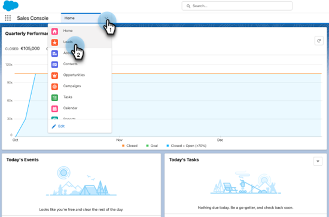
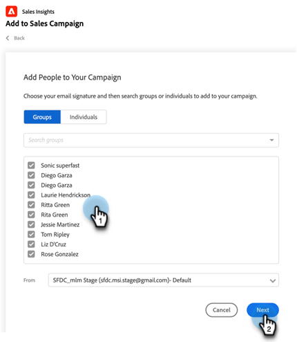
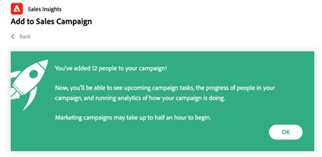

# Opsomming toevoegen aan verkoopcampagne in Salesforce gebruiken {#using-bulk-add-to-sales-campaign-in-salesforce}

Leer hoe u in grote hoeveelheden toevoegt aan verkoopcampagne in Salesforce om uw uitgaande communicatie te schalen met Verkoopacties.

>[!NOTE]
>
>Salesforce past een limiet van 200 records toe die tegelijk kunnen worden geselecteerd.

>[!PREREQUISITES]
>
>Zorg ervoor u het [ recentste pakket van Insight van de Verkoop ](/help/marketo/product-docs/marketo-sales-insight/msi-for-salesforce/upgrading/upgrading-your-msi-package.md){target="_blank"} aan uw instantie van Salesforce hebt geïnstalleerd en de [ knopen van de Actie ](/help/marketo/product-docs/marketo-sales-insight/actions/crm/salesforce-package-configuration/add-action-buttons-to-salesforce-list-view.md){target="_blank"} op uw contact en de mening van de loodlijst in Salesforce gevormd.

## Bulksgewijs toevoegen aan verkoopcampagne in Salesforce Lightning {#bulk-add-to-sales-campaign-in-salesforce-lightning}

1. In Salesforce, navigeer aan de het huispagina van Leads/Contacten door op **te klikken leidt/Contacten** tabel.

   

1. In de **drop-down Mening**, selecteer de gewenste mening van Leads/Contacten u wilt e-mailen.

   >[!TIP]
   >
   >U kunt een nieuwe mening tot stand brengen door het cogapictogram op het recht te klikken en **Nieuw** te selecteren. Nadat u de weergave een nieuwe naam hebt gegeven en deze hebt opgeslagen, kunt u op het filterpictogram aan de rechterkant klikken om naar de gewenste set leads/contactpersonen die u wilt e-mailen, te gaan.

1. Kies de gewenste lood of contactenlijst en klik **toevoegen aan de Campagne van de Verkoop** knoop.

   

1. U zult aan de Modaal van de Campagne van de Verkoop van Acties, met de ontvangers worden genavigeerd u hebt geselecteerd toegevoegd.

1. Maak om het even welke uitgeeft nodig om mensen of groepen te verwijderen, dan klik **daarna**.

   

1. Selecteer de categorie Verkoopcampagne die u wilt gebruiken in de vervolgkeuzelijst Categorieën.

1. Selecteer de Campagne van de Verkoop u de geselecteerde mensen aan wilt toevoegen en **daarna** klikken.

   

1. U ziet mogelijk verschillende opties, afhankelijk van de eerste stap in uw campagne. Als uw eerste stap een e-mail is, kunt u het e-mailbericht voor elke ontvanger bewerken, zoals hieronder wordt weergegeven. Zodra dit wordt gedaan, klik **daarna**.

   

1. Opnieuw, als uw eerste stap een e-mail is en u het vormde om u toe te staan om te selecteren wanneer de campagne lanceert, zult u de optie aan **Begin** of **hebben nu een Nieuwe Tijd van het Begin** plannen. Zodra dit is voltooid, klik **Begin**.

   

Nadat u op Start hebt geklikt, wordt er een bevestigingsscherm weergegeven waarin u kunt zien hoeveel personen zijn toegevoegd.

## Bulksgewijs toevoegen aan verkoopcampagne in Salesforce Classic {#bulk-add-to-sales-campaign-in-salesforce-classic}

1. In Salesforce, klik **Leads/Contacten** tabel.

1. In de drop-down Mening, selecteer de gewenste mening van Leads/Contacten u wilt e-mailen en **klikken gaat**.

   

   >[!TIP]
   >
   >U kunt een nieuwe weergave maken door op Nieuwe weergave maken te klikken en de beschikbare filters te configureren om de lijst met ontvangers die u per e-mail wilt verzenden, te beperken.

1. Kies de gewenste lood of contactlijst en klik **toevoegen aan de Campagne van de Verkoop** knoop.

   

1. U zult aan de Modaal van de Campagne van de Verkoop van Acties met de geselecteerde mensen worden genavigeerd.

1. Maak om het even welke uitgeeft nodig om mensen of groepen te verwijderen, dan klik **daarna**.

   

1. Selecteer de categorie van de Campagne van de Verkoop u van de **drop-down Categorieën** wilt gebruiken.

1. Selecteer de Campagne van de Verkoop u de geselecteerde mensen aan wilt toevoegen en **daarna** klikken.

   

1. U ziet mogelijk verschillende opties, afhankelijk van de eerste stap in uw campagne. Als uw eerste stap een e-mail is, kunt u het e-mailbericht voor elke ontvanger bewerken, zoals hieronder wordt weergegeven. Zodra dit wordt gedaan, klik **daarna**.

   

1. Opnieuw, als uw eerste stap een e-mail is en u het vormde om u toe te staan om te selecteren wanneer de campagne lanceert, zult u de optie aan **Begin** of **hebben nu een Nieuwe Tijd van het Begin** plannen. Zodra dit is voltooid, klik **Begin**.

   

Nadat u op Start hebt geklikt, wordt er een bevestigingsscherm weergegeven waarin u kunt zien hoeveel personen zijn toegevoegd.

