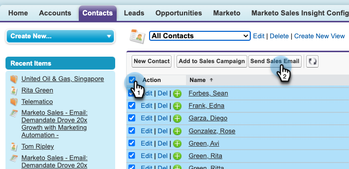
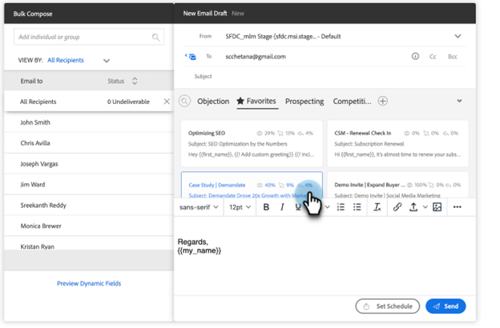

# Verkoop via e-mail verzenden in Salesforce gebruiken {#using-bulk-send-sales-email-in-salesforce}

Leer hoe u in Salesforce bulksgewijze e-mails kunt verzenden om uw uitgaande communicatie te schalen met Verkoopacties.

>[!NOTE]
>
>Salesforce hanteert een limiet van 200 records die tegelijk kunnen worden geselecteerd.

>[!PREREQUISITES]
>
>Controleer of u de [Het meest recente verkooppakket](/help/marketo/product-docs/marketo-sales-insight/msi-for-salesforce/upgrading/upgrading-your-msi-package.md){target="_blank"} to your Salesforce instance and have configured the [Action buttons](/help/marketo/product-docs/marketo-sales-insight/actions/crm/salesforce-package-configuration/add-action-buttons-to-salesforce-list-view.md){target="_blank"} in Salesforce.

## Bulkmail verzenden in Salesforce Lightning {#sending-bulk-email-in-salesforce-lightning}

1. Navigeer in Salesforce naar de startpagina voor leads/contactpersonen door op de knop **Leads/contactpersonen** tab.

   

1. Selecteer in de vervolgkeuzelijst Weergave de gewenste weergave van leads/contactpersonen die u wilt e-mailen.

   >[!TIP]
   >
   >U kunt een nieuwe weergave maken door op het cogopictogram rechts te klikken en **Nieuw**. Nadat u de weergave een nieuwe naam hebt gegeven en deze hebt opgeslagen, kunt u op het filterpictogram aan de rechterkant klikken om naar de gewenste set leads/contactpersonen die u wilt e-mailen, te gaan.

1. Kies de gewenste lijst met leads of contactpersonen en klik op de knop **Verkoop-e-mail verzenden** knop.

   

1. U wordt naar het samenstellingsvenster Handelingen genavigeerd, met de personen die u hebt geselecteerd.

1. Selecteer de sjabloon die u wilt invoegen in de werkbalk van het samenstellingenvenster of schrijf een aangepaste e-mail.

   >[!TIP]
   >
   >Gebruiken [Vastgezette categorieën](/help/marketo/product-docs/marketo-sales-insight/actions/email/using-the-compose-window/using-a-template-in-the-compose-window.md#pinning-template-categories-in-the-compose-window){target="_blank"} om gemakkelijker toegang te bieden tot je favoriete e-mailsjablonen.

   **OPTIONELE STAP**: Geef een voorvertoning weer van alle dynamische velden door op de knop **Dynamische velden voorvertonen** knop.

   >[!TIP]
   >
   >Als u een sjabloon wilt aanpassen voor alle ontvangers en u klikt op de optie Alle ontvangers in de zijbalk Samenstellen bulk, kunt u alle gewenste e-mails tegelijk bewerken. Als u een wijziging wilt aanbrengen in een specifiek e-mailbericht, klikt u op de naam of het e-mailbericht van de ontvanger in het zijpaneel Samenstellen bulk. Houd er rekening mee dat als u wijzigingen aanbrengt in een afzonderlijke e-mail en vervolgens wijzigingen aanbrengt terwijl u Alle ontvangers selecteert, de wijzigingen die u aanbrengt in Alle ontvangers de wijzigingen overschrijven die in de afzonderlijke e-mail zijn aangebracht.

1. Selecteren **Verzenden** om de e-mail onmiddellijk te verzenden, of **Schema instellen** om een datum en tijd in te stellen voor het verzenden van het e-mailbericht.

   

## Bulkmail verzenden in Salesforce Classic {#sending-bulk-email-in-salesforce-classic}

1. Klik in Salesforce op de knop **Leads/contactpersonen** tab.

1. Selecteer in de vervolgkeuzelijst Weergave de gewenste weergave van leads/contactpersonen die u wilt e-mailen en klik op **Ga**.

   

   >[!TIP]
   >
   >U kunt een nieuwe mening tot stand brengen door tot de Nieuwe Mening te klikken en de beschikbare filters te vormen om onderaan de lijst te versmallen van wie u aan een Campagne van de Verkoop toevoegt.

1. Kies de gewenste lijst met leads of contactpersonen en klik op de knop **Verkoop-e-mail verzenden** knop.

   

1. U zult aan het Acties samenstellen venster met de ontvangers worden genavigeerd u in samenstelt venster selecteerde.

1. Selecteer de sjabloon die u wilt invoegen in de werkbalk van het samenstellingenvenster of schrijf een aangepaste e-mail.

   

   >[!TIP]
   >
   >Gebruiken [Vastgezette categorieën](/help/marketo/product-docs/marketo-sales-insight/actions/email/using-the-compose-window/using-a-template-in-the-compose-window.md#pinning-template-categories-in-the-compose-window){target="_blank"} om gemakkelijker toegang te bieden tot je favoriete e-mailsjablonen.

   **OPTIONELE STAP**: Geef een voorvertoning weer van alle dynamische velden door op de knop **Dynamische velden voorvertonen** knop.

   >[!TIP]
   >
   >Als u een sjabloon wilt aanpassen voor alle ontvangers en u klikt op de optie Alle ontvangers in de zijbalk Samenstellen bulk, kunt u alle gewenste e-mails tegelijk bewerken. Als u een wijziging wilt aanbrengen in een specifiek e-mailbericht, klikt u op de naam of het e-mailbericht van de ontvanger in het zijpaneel Samenstellen bulk. Houd er rekening mee dat als u wijzigingen aanbrengt in een afzonderlijke e-mail en vervolgens wijzigingen aanbrengt terwijl u Alle ontvangers selecteert, de wijzigingen die u aanbrengt in Alle ontvangers de wijzigingen overschrijven die in de afzonderlijke e-mail zijn aangebracht.

1. Selecteren **Verzenden** om de e-mail onmiddellijk te verzenden, of **Schema instellen** om een datum en tijd in te stellen voor het verzenden van het e-mailbericht.
