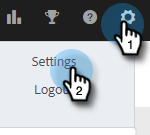
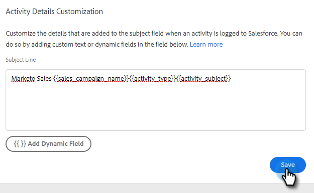

# [!DNL Salesforce] Aanpassing activiteitendetails configureren {#configure-salesforce-activity-detail-customization}

>[!PREREQUISITES]
>
>* De Acties van Salesforce en van Insight van de Verkoop [&#x200B; moeten worden verbonden &#x200B;](/help/marketo/product-docs/marketo-sales-insight/actions/crm/salesforce-integration/connect-your-sales-insight-actions-account-to-salesforce.md)
>* Het registreren van e-mailactiviteit via API [&#x200B; moet worden toegelaten &#x200B;](/help/marketo/product-docs/marketo-sales-insight/actions/crm/salesforce-integration/sync-sales-activities-to-salesforce.md)

Met Aanpassing van activiteitsdetails kunnen beheerders de informatie configureren die zich aanmeldt bij het veld [!DNL Salesforce] Taak - Onderwerp wanneer een [!DNL Sales Insight Actions] activiteit/herinneringstaak wordt gesynchroniseerd met [!DNL Salesforce] .

>[!NOTE]
>
>* Updates die in [!DNL Sales Insight Actions] van een herinneringstaak aan het onderwerpveld van een [!DNL Salesforce] -taak worden aangebracht, worden weergegeven in het onderwerpveld van die `{{activity_subject}}` -taak als u het dynamische veld in de aanpassing van het Activiteitendetail gebruikt.
>* Regeleinden worden niet ondersteund wanneer gegevens worden geregistreerd naar het onderwerpveld van [!DNL Salesforce] . Om het even welke lijnonderbrekingen in de redacteur van de Aanpassing van het Detail van de Activiteit zullen worden verwijderd wanneer een onderwerp van de verkooptaak wordt bijgewerkt.

<table>
 <tr>
  <td><strong>1</td>
  <td>Taak InMail-herinnering</td>
 </tr>
 <tr>
  <td><strong>2</td>
  <td>E-mailactiviteit</td>
 </tr>
 <tr>
  <td><strong>3</td>
  <td>Oproepactiviteit</td>
 </tr>
</table>

De functie kan worden gebruikt om de volgende voordelen te ontgrendelen:

* Door aan te passen welke informatie zichtbaar is op het onderwerpveld, kunnen de activiteitsgegevens gemakkelijk worden gescand voor verkoop in Salesforce.
* Beheerders kunnen het onderwerpveld labelen met een unieke id, zoals &quot;Mkto_sales&quot;, zodat activiteiten van Insight-acties voor verkoop gemakkelijk kunnen worden geïdentificeerd en onderscheiden van andere e-mailactiviteiten, activiteiten voor oproepen en taken.
* Verminder de behoefte aan de gebieden van de douaneactiviteit. Salesforce past limieten toe op het aantal velden voor aangepaste activiteiten, waardoor kan worden beperkt welke gegevens beschikbaar zijn voor gebruik in rapporten. Als u dynamische velden voor activiteiten gebruikt om toetsgegevens toe te voegen aan de onderwerpregel, kunt u het aantal aangepaste activiteitsvelden verminderen dat u in uw Salesforce-instantie moet maken.
* Het onderwerpveld van activiteiten en taken volgt een consistent patroon dat is gedefinieerd door de Sales Insight Actions Admin.

>[!NOTE]
>
>Als u e-mailantwoorden registreert als activiteiten aan [!DNL Salesforce] , worden de instellingen voor [!DNL Salesforce] Aanpassing activiteitendetails niet gebruikt. In plaats daarvan registreert u zich als &quot;Reply: Email Subject&quot;.

## Ondersteunde dynamische velden voor activiteiten {#activity-dynamic-fields-supported}

De dynamische de verwijzingsinformatie van Gebieden van de activiteit over uw verkoopactiviteiten om gegevens te bevolken. Vandaag de dag kunnen ze worden gebruikt met [!DNL Salesforce] Activity Detail Customization.

>[!NOTE]
>
>Als er geen waarde is om het dynamische gebied voor een specifieke activiteit/taak te bevolken, zal het geen gegevens voor dat dynamische gebied bevolken wanneer het Taak - Onderwerp van Salesforce Gebied wordt bijgewerkt.

<table>
 <tr>
  <th>Veld</th>
  <th>Beschrijving</th>
 </tr>
 <tr>
  <td>{{activity_type}}</td>
  <td>Het taaktype wordt ingevuld als E-mail, Bel, InMail of Aangepast.</td>
 </tr>
 <tr>
  <td>{{activity_subject}}</td>
  <td>
Zal het onderwerp van de taak vullen.

      
In het geval van een e-mail wordt de onderwerpregel van de e-mail ingevuld.

      
In het geval van vraag, inMail, of douane, zal het een waarde bevolken als er een herinneringstaak was die met een waarde op het de taaknaam/onderwerpgebied werd gecreeerd.
</td>
 </tr>
 <tr>
  <td>{{sales_campaign_name}}</td>
  <td>Als de activiteit van een verkoopcampagne werd geïnitieerd, zal het de naam van de verkoopcampagne bevolken.</td>
 </tr>
 <tr>
  <td>{{sales_campaign_day}}</td>
  <td>Als de activiteit van een verkoopcampagne werd geïnitieerd, zal het het aantal van de de verkoopcampagne dag van deze activiteit bevolken op.</td>
 </tr>
 <tr>
  <td>{{sales_campaign_step}}</td>
  <td>Als de activiteit van een verkoopcampagne werd geïnitieerd, zal het het stapaantal binnen de dag van de verkoopcampagne bevolken deze activiteit op voorkwam.</td>
 </tr>
 <tr>
  <td>{{call_outcome}}</td>
  <td>Als de activiteit een vraag is en een vraagresultaat wordt geselecteerd, zal dit de waarde van het vraagresultaat bevolken.</td>
 </tr>
 <tr>
  <td>{{call_reason}}</td>
  <td>Als de activiteit een vraag is en een vraagreden wordt geselecteerd, zal dit de waarde van de vraagreden bevolken.</td>
 </tr>
</table>

## [!DNL Salesforce] Aanpassing activiteitengegevens configureren {#configuring-salesforce-activity-detail-customization}

>[!NOTE]
>
>**vereiste toestemmingen Admin.**

Wanneer het vormen van uw activiteitendetails, overweeg welke gegevens voor verkoop het meest relevant zouden zijn wanneer het herzien van taakgeschiedenis in [!DNL Salesforce].

1. Klik op het tandwielpictogram en selecteer **[!UICONTROL Settings]** .

   

1. Klik op **[!UICONTROL Salesforce]**.

   

1. Klik op **[!UICONTROL Sync Settings]**.

   

1. Voeg in de redacteur van de Aanpassing van de Details van de Activiteit om het even welke vrije tekst toe u wilt. De tekst die u toevoegt, is niet dynamisch en blijft ongewijzigd voor het onderwerpveld van alle taken die zijn gesynchroniseerd met [!DNL Salesforce] .

   

   >[!TIP]
   >
   >Hoewel het niet nodig is om toegevoegde tekst tussen rechte haakjes te plaatsen, is het voor sommige mensen gemakkelijker om tussen de gegevens te onderscheiden wanneer deze worden gevuld met een onderwerpveld in [!DNL Salesforce] . Voorbeeld: `[Sales Insight Actions] - {{Activity_type}}`

1. Voeg aanvullende dynamische velden toe die u wilt toevoegen door op de knop **[!UICONTROL Add Dynamic Field]** te klikken.

   

1. Selecteer de gewenste dynamische velden.

   

1. Klik op **[!UICONTROL Save]**.

   

>[!NOTE]
>
>[!DNL Salesforce] past een limiet van 255 tekens toe. Als uw activiteitendetails dit overschrijden, wordt het afgebroken om ervoor te zorgen dat de informatie wordt opgeslagen in het onderwerpveld [!DNL Salesforce] .

>[!MORELIKETHIS]
>
>* [&#x200B; de Activiteiten van de Verkoop van de Synchronisatie aan Salesforce &#x200B;](/help/marketo/product-docs/marketo-sales-insight/actions/crm/salesforce-integration/sync-sales-activities-to-salesforce.md)
>* [&#x200B; de Synchronisatie van de Taak van de herinnering met Salesforce &#x200B;](/help/marketo/product-docs/marketo-sales-insight/actions/tasks/reminder-task-sync-with-salesforce.md)
