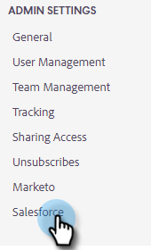
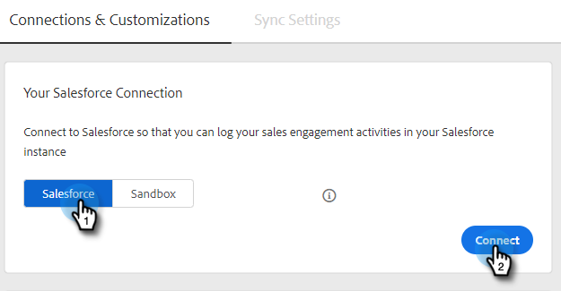

# Sluit uw [!DNL Sales Insight Actions] -account aan op [!DNL Salesforce] {#connect-your-sales-insight-actions-account-to-salesforce}

Voer de volgende eenvoudige stappen uit om [!DNL Sales Insight Actions] -account te verbinden met [!DNL Salesforce] .

## Verbinding maken als beheerder {#how-to-connect-as-an-admin}

1. Klik op het tandwielpictogram en selecteer **[!UICONTROL Settings]** .

   

1. Klik onder [!UICONTROL Admin Settings] op **[!UICONTROL Salesforce]** .

   

1. Klik op het tabblad [!UICONTROL Connections & Customizations] op **[!UICONTROL Salesforce]** then **[!UICONTROL Connect]** .

   

1. Klik op **[!UICONTROL OK]**.

   

1. Als u al bent aangemeld bij Salesforce, hebt u verbinding. Als je dat niet bent, wordt je gevraagd je aan te melden.

## Verbinding maken als een niet-beheerder {#how-to-connect-as-a-non-admin}

1. Klik op het tandwielpictogram en selecteer **[!UICONTROL Settings]** .

   

1. Selecteer onder [!UICONTROL My Account] de optie **[!UICONTROL Salesforce]** .

1. Klik in de [!UICONTROL Connections & Customizations tab] op **[!UICONTROL Salesforce]** then **[!UICONTROL Connect]** .

   

1. Klik op **[!UICONTROL OK]**.

   

1. Als u al bent aangemeld bij Salesforce, hebt u verbinding. Als je dat niet bent, wordt je gevraagd je aan te melden.
