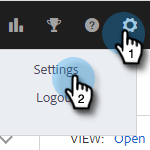

# [!DNL Salesforce] Verbinding verbreken met [!DNL Sales Insight Actions] {#disconnect-salesforce-from-sales-insight-actions}

Soms moet u de verbinding tussen uw [!DNL Salesforce] -account en uw [!DNL Sales Insight Actions] -account verbreken. Zo gaat het.

## [!UICONTROL Salesforce] Verbinding met beheerder verbreken {#how-to-disconnect-from-salesforce-as-an-admin}

1. Klik in [!DNL Sales Insight Actions] op het tandwielpictogram rechtsboven en selecteer **[!UICONTROL Settings]** .

   

1. Klik onder [!UICONTROL Admin Settings] op **[!UICONTROL Salesforce]** .

   

1. Klik op het tabblad [!UICONTROL Connections & Customizations] op **[!UICONTROL Disconnect]** .

   

## [!DNL Salesforce] Verbinding met een niet-beheerder verbreken {#how-to-disconnect-from-salesforce-as-a-non-admin}

1. Klik in [!DNL Sales Insight Actions] op het tandwielpictogram rechtsboven en selecteer **[!UICONTROL Settings]** .

   

1. Selecteer onder [!UICONTROL My Account] de optie **[!UICONTROL Salesforce]** .

PICC

1. Klik op het tabblad [!UICONTROL Connections & Customizations] op **[!UICONTROL Disconnect]** .

PICC
