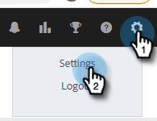

# Verkoopactiviteiten synchroniseren met Salesforce {#sync-sales-activities-to-salesforce}

U kunt de Actions Salesforce Sync Settings configureren om e-mail- en telefoonactiviteiten te registreren bij Salesforce. Dit biedt een betere zichtbaarheid voor teams die werken vanuit uw CRM en stelt managers in staat deze activiteiten te gebruiken om aangepaste Salesforce-rapporten te maken om de prestaties van uw teams te volgen.

## E-mailactiviteiten aanmelden bij Salesforce via API {#logging-email-activity-to-salesforce-via-api}

Voor deze functionaliteit moet u zich op de Enterprise/Unlimited Edition van Salesforce bevinden, of de Professional Edition als u Integratie via de Web Services API hebt aangeschaft.

>[!PREREQUISITES]
>
>Salesforce- en Sales Insight-acties moeten zijn verbonden.

1. In de Acties van Insight van de Verkoop, klik het tandwielpictogram en selecteer **Montages**.

   

1. Onder Montages Admin (of &quot;Mijn Rekening&quot;als u geen Admin bent), klik **Salesforce**.

   

1. Klik de **Montages van de Synchronisatie** tabel.

   

1. Klik op de pijl naast Log Email Activity to Salesforce.

   

1. Klik **Salesforce API** tabel. Op deze kaart kunt u uw voorkeur instellen voor het aanmelden van gegevens bij Salesforce. Klik **sparen** wanneer gedaan.

   

## E-mailactiviteit bij Salesforce aanmelden via e-mail naar Salesforce (BCC) {#logging-email-activity-to-salesforce-via-email-to-salesforce-bcc}

Nadat je &quot;E-mail naar Salesforce (BCC)&quot; hebt geactiveerd, ontvang je een BCC van je e-mails over verkopen en worden je e-mails geregistreerd als activiteiten op het gebied van kansen, leads en contactpersonen.

>[!PREREQUISITES]
>
>Salesforce- en Sales Insight-acties moeten zijn verbonden.

**om uw e-mails in Salesforce via E-mail (BCC) te registreren**

1. In de Verkoop van Marketo, klik het tandwielpictogram en selecteer **Montages**.

   

1. Onder Montages Admin (of &quot;Mijn Rekening&quot;als u geen Admin bent), klik **Salesforce**.

   

1. Klik de **Montages van de Synchronisatie** tabel.

   

1. Klik **E-mail aan Salesforce (BCC)** tabel en klik **activeren**.

   

Als uw e-mailadres naar Salesforce om een of andere reden niet wordt ingevoerd, voert u de volgende stappen uit om de BCC-functie in uw Salesforce-account te activeren:

1. Meld u aan bij uw Salesforce-exemplaar.
1. Zoek de gebruikersnaam in de rechterbovenhoek en selecteer de vervolgkeuzelijst.
1. Selecteer **Mijn Montages**.
1. Selecteer **E-mail**.
1. Selecteer **Mijn E-mail aan Salesforce**.
1. Op deze pagina wordt het veld E-mail naar Salesforce-adres weergegeven. Als er niets naast het is bevolkt, scrol neer aan &quot;Mijn Acceptabele E-mailadressen.&quot;
1. Voer het e-mailadres of de e-mailadressen in die u voor BCC wilt gebruiken.
1. Klik **sparen Veranderingen**.

**kan Mijn e-mail aan Salesforce niet vinden in Mijn Montages**

Als Mijn e-mail naar Salesforce niet wordt weergegeven onder de instellingen, is het mogelijk dat uw beheerder deze functie niet heeft ingeschakeld. Dit kan gebeuren als uw team nieuw is voor Salesforce of als uw team het BCC-adres dat Salesforce verschaft, nooit heeft gebruikt.

>[!NOTE]
>
>U hebt beheerdersrechten nodig om dit in te stellen.

1. Klik **Opstelling**.
1. Klik **E-mailBeleid**.
1. Klik **E-mail aan Salesforce**.
1. Klik **uitgeven**.
1. Schakel het selectievakje naast Actief in.
1. Klik **sparen**.

## Taken en herinneringen voor Insight-verkoopacties synchroniseren met Salesforce-taken {#sync-sales-insight-actions-tasks-reminders-to-salesforce-tasks}

1. In de Acties van Insight van de Verkoop, klik het tandwielpictogram en selecteer **Montages**.

   

1. Onder Montages Admin (of &quot;Mijn Rekening&quot;als u geen Admin bent), klik **Salesforce**.

   

1. Klik de **Montages van de Synchronisatie** tabel.

   

1. Klik op de pijl naast Marketo Sales Tasks/Reminders synchroniseren met Salesforce Tasks.

   

1. Kies de gewenste optie (&quot;Niet synchroniseren met Salesforce-taken&quot; is standaard ingeschakeld).

   

## De Taken van de Acties van Insight van de Verkoop met Salesforce voor het eerst synchroniseren {#syncing-sales-insight-ations-tasks-with-salesforce-for-the-first-time}

Wanneer u de synchronisatie tussen Sales Insight Actions en Salesforce taken voor het eerst inschakelt, importeren we uw Salesforce taken. We gaan geen nieuwe taken uitvoeren die je hebt in Verkoopacties voor Insight naar Salesforce. Om rommelige en duplicaten te verminderen, zijn de enige taken die van de Acties van Insight van de Verkoop in Salesforce worden gesynchroniseerd taken die worden gecreeerd nadat u de Acties van Insight van de Verkoop met SFDC synchroniseert.

Dit is wat er gebeurt als je Verkoopacties en SFDC-taken synchroniseert:

* Zodra u op Opslaan klikt voor het synchroniseren van taken, wordt er gesynchroniseerd. Dit zal aanvankelijk enige tijd duren.

* Herinneringen die in de afgelopen 24 uur zijn bijgewerkt of gemaakt, worden vanuit SFDC naar Handelingen voor Insight voor verkoop opgehaald. De synchronisatie is gebaseerd op de vervaldatum en al die taken zullen op het achterste eind worden gesynchroniseerd, maar in het Centrum van het Bevel, zult u slechts taken zien die vandaag en morgen verschuldigd zijn.

* Als synchronisatie eerder is ingeschakeld en u taken in SFDC verwijdert, worden alle taken die in de afgelopen 15 dagen zijn verwijderd, ook uit Command Center verwijderd.

* We synchroniseren voortdurend taken tussen Sales Insight Actions en SFDC zolang de synchronisatie is ingeschakeld.

* Na de eerste synchronisatie worden alle taken die u maakt, bewerkt, voltooit of verwijdert in Sales Insight Actions, gesynchroniseerd met de takenlijst in Salesforce. En alles wat in Salesforce is gemaakt, bewerkt, voltooid of verwijderd, werkt je takenlijst bij in Sales Insight Actions.

* Als u deze synchronisatie wilt inschakelen, schakelt u gewoon het synchronisatievak in op de pagina Instellingen in de webtoepassing.
