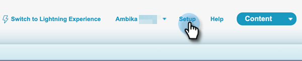
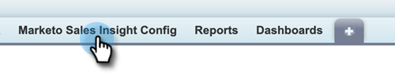

# [!DNL Sales Insight Actions] Configuratie in [!DNL Salesforce] {#sales-insight-actions-configuration-in-salesforce}

>[!PREREQUISITES]
>
>* [&#x200B; installeer &#x200B;](/help/marketo/product-docs/marketo-sales-insight/msi-for-salesforce/installation/install-marketo-sales-insight-package-in-salesforce-appexchange.md) of [&#x200B; Verbetering &#x200B;](/help/marketo/product-docs/marketo-sales-insight/msi-for-salesforce/upgrading/upgrading-your-msi-package.md) het Pakket van Insight van de Verkoop in uw [!DNL Salesforce] instantie
>* [&#x200B; Vorm Insight van de Verkoop van Marketo in  [!DNL Salesforce]  Onderneming/Onbeperkt &#x200B;](/help/marketo/product-docs/marketo-sales-insight/msi-for-salesforce/configuration/configure-marketo-sales-insight-in-salesforce-enterprise-unlimited.md)

## Nieuwe externe site toevoegen in [!DNL Salesforce] {#add-new-remote-site-in-salesforce}

1. Klik in [!DNL Salesforce] op **[!UICONTROL Setup]** .

   

1. Zoek naar &quot;[!UICONTROL remote site]&quot;en selecteer **[!UICONTROL Remote Site Settings]**.
   

1. Klik op **[!UICONTROL New Remote Site]**.

   

1. Ga de Verre Naam van de Plaats in (het kan iets als &quot;MarketoSalesInsight1&quot;zijn). Voer de URL van de externe site in `https://ims-na1.adobelogin.com` en klik op **[!UICONTROL Save]** .

   

1. Klik nogmaals op **[!UICONTROL New Remote Site]** .

   

1. Ga de Verre Naam van de Plaats in (het kan iets als &quot;MarketoSalesInsight2&quot;zijn). Voer de URL van de externe site in `https://mkto-sales-connect.adobe.io` en klik op **[!UICONTROL Save]** .

## [!DNL Sales Insight Actions] inschakelen voor alle CRM-toepassingen {#enabling-sales-insight-actions-across-the-crm}

1. Klik in [!DNL Salesforce] op de tab **[!UICONTROL Marketo Sales Insight Config]** .

   

   >[!NOTE]
   >
   >Als u &quot;[!UICONTROL Marketo Sales Insight Config]&quot;niet ziet in uw hoogste bar, klik **+** teken en vind het onder Alle Lusjes.

1. Schakel het selectievakje **[!UICONTROL Enable MSI Actions]** in.

   

1. Voer de [!UICONTROL API Secret Key] in.

   

   >[!NOTE]
   >
   >Als u uw [!UICONTROL API Secrey Key] handig niet hebt, kunt u het vinden door de stappen in [&#x200B; dit artikel &#x200B;](/help/marketo/product-docs/marketo-sales-insight/msi-for-salesforce/configuration/configure-marketo-sales-insight-in-salesforce-enterprise-unlimited.md) te volgen.

1. Klik op **[!UICONTROL Save]** als u klaar bent.

Hierdoor worden automatisch alle functies van MSI-handelingen ingeschakeld die in het artikel met het overzicht van functies worden beschreven.

>[!NOTE]
>
>U kunt alle functies van MSI-acties uitschakelen door het selectievakje MSI-acties inschakelen uit te schakelen.

## Beheer van MSI-acties {#msi-actions-governance}

1. U kunt Verkoopcampagnes en/of het tabblad Taak in de volgende sectie uitschakelen. Dit is van toepassing op de deelvensters lood, contact, account en opportunity.

   

1. U kunt MSI-handelingen uitschakelen door de bijbehorende functies onder [!UICONTROL Actions settings] uit te schakelen.

   

>[!NOTE]
>
>De montages van de governance zijn van toepassing op alle gebruikers MSI.
