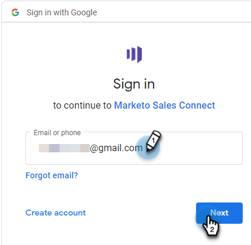

# Verbinding maken met Gmail {#connect-to-gmail}

Als u verbinding maakt met Gmail, ontvangt u het bijhouden van antwoorden, toegang tot het Gmail-leveringskanaal, de mogelijkheid om e-mails te plannen in Gmail en de compatibiliteit te verzenden.

>[!CAUTION]
>
>Als u [&#x200B; filters &#x200B;](https://support.google.com/mail/answer/6579?hl=en#zippy=%2Ccreate-a-filter%2Cedit-or-delete-filters){target="_blank"} of regels in uw rekening van Gmail gebruikt om e-mail automatisch te merken zoals gelezen, kan dit kwesties met antwoord het volgen veroorzaken. We raden u aan om regels uit te schakelen die e-mails automatisch markeren als gelezen bij het volgen van antwoorden met Gmail.

1. In de Verkoop van Marketo, klik het tandwielpictogram en selecteer **Montages**.

   

1. Onder Mijn Rekening, uitgezochte **E-mailmontages**.

   

1. Klik het **E-mailverbinding** lusje.

   

1. Klik **krijgen Begonnen**.

   

1. Selecteer **ik Gmail gebruik om e-mail** te verzenden en **daarna** te klikken.

   

1. Klik **OK**.

   

1. Als u zich al hebt aangemeld bij Gmail, kiest u de account waarmee u verbinding wilt maken. Als niet, ga uw adres van Gmail in en klik **daarna**. In dit voorbeeld zijn we nog niet aangemeld.

   

1. Ga uw wachtwoord in en klik **daarna**.

   

1. Klik **toestaan**.

   

   U kunt deze verbinding gebruiken om e-mailberichten en ook als leveringskanaal bij te houden.

>[!NOTE]
>
>Gmail dwingt zijn eigen verzendingsgrenzen af. [&#x200B; leer hier meer &#x200B;](/help/marketo/product-docs/marketo-sales-connect/email/email-delivery/email-connection-throttling.md#email-provider-limits).
