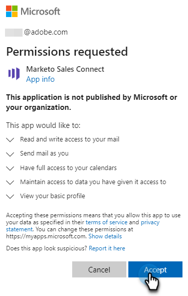

# Verbinding maken met Outlook {#connect-to-outlook}

Leer hoe u uw account voor Handelingen in het kader van Handelingen in het kader van het verkoopinzicht kunt verbinden met Outlook.

>[!NOTE]
>
>Elke gebruiker moet verbinding maken met Outlook vanaf zijn Marketo-verkoopaccount.

## Verbinding maken met Outlook Online {#connecting-to-outlook-online}

Het verbinden met Vooruitzichten betekent u antwoord het volgen, toegang tot het de leveringskanaal van Vooruitzichten, de capaciteit zult ontvangen om e-mails in Vooruitzichten te plannen, en naleving te verzenden.

1. Klik in Marketo Sales op het tandwielpictogram en selecteer **Instellingen**.

   

1. Selecteer onder Mijn account de optie **E-mailinstellingen**.

   

1. Klik op de knop **E-mailverbinding** tab.

   

1. Klikken **Aan de slag**.

   

1. Selecteren **Ik gebruik Outlook om e-mailberichten te verzenden** en klik op **Volgende**.

   

1. Selecteer de versie van Vooruitzichten u gebruikt en klik **Volgende**. In dit voorbeeld kiezen we Outlook Online.

   

   <table> 
    <tbody>
     <tr>
      <td><strong>Outlook Online</strong></td> 
      <td>Wordt ook online genoemd als Exchange</td> 
     </tr>
     <tr>
      <td><strong>Exchange op locatie</strong></td> 
      <td>Inclusief Exchange 2013 en 2016</td> 
     </tr>
    </tbody>
   </table>

   >[!NOTE]
   >
   >Marketo biedt momenteel geen ondersteuning voor Hybride Exchange-accounts.

1. Klikken **OK**.

   

1. Als u niet aan Vooruitzichten het programma wordt geopend, ga uw login info in en klik **Volgende**. Kies in dat geval de account waarmee u verbinding wilt maken en klik op **Volgende**. In dit voorbeeld zijn we al aangemeld.

   

1. Klikken **Accepteren**.

   

   U kunt deze verbinding gebruiken om e-mailberichten en ook als leveringskanaal bij te houden.

   >[!NOTE]
   >
   >De vooruitzichten online (Office365) dwingen zijn eigen verzendende grenzen af. [Meer informatie hier](/help/marketo/product-docs/marketo-sales-connect/email/email-delivery/email-connection-throttling.md#email-provider-limits).

## Verbinding maken met Exchange op locatie {#connecting-to-exchange-on-premise}

Het verbinden met Uitwisseling op locatie betekent u antwoord het volgen, toegang tot het de leveringskanaal van Vooruitzichten, de capaciteit zult ontvangen om e-mails in Vooruitzichten te plannen, en naleving te verzenden.

1. Klik in Marketo Sales op het tandwielpictogram en selecteer **Instellingen**.

   

1. Selecteer onder Mijn account de optie **E-mailinstellingen**.

   

1. Klik op de knop **E-mailverbinding** tab.

   

1. Klikken **Aan de slag**.

   

1. Selecteren **Ik gebruik Outlook om e-mailberichten te verzenden** en klik op **Volgende**.

   

1. Selecteer de versie van Vooruitzichten u gebruikt en klik **Volgende**. In dit voorbeeld kiezen wij Uitwisseling op-gebouw.

   

   <table> 
    <tbody>
     <tr>
      <td><strong>Outlook Online</strong></td> 
      <td>Wordt ook online genoemd als Exchange</td> 
     </tr>
     <tr>
      <td><strong>Exchange op locatie</strong></td> 
      <td>Inclusief Exchange 2013 en 2016</td> 
     </tr>
    </tbody>
   </table>

1. Voer uw gegevens in en klik op **Verbinden**.

   

   >[!NOTE]
   >
   >Als u Autodiscover in de drop-down van de Versie van de Uitwisseling uitzet, zult u uw afdeling van IT voor de Uitwisseling URL moeten vragen.

   U kunt deze verbinding gebruiken om e-mailberichten en ook als leveringskanaal bij te houden.

   >[!NOTE]
   >
   >Wanneer het gebruiken van Uitwisseling On-prem, zal uw Team van IT uw e-mail verzendende grens vestigen.

## Toestemming krijgen om online verbinding te maken met Outlook {#getting-permission-to-connect-to-outlook-online}

U moet mogelijk met uw IT-team samenwerken om toestemming te krijgen om Marketo Sales in staat te stellen verbinding te maken met uw Outlook Online-account (Microsoft 365).

>[!NOTE]
>
>Stel het IT-team dat uw Microsoft 365-account beheert, ervan op de hoogte dat de toepassing die toegang nodig heeft &#39;Marketo Sales Connect&#39; is.

Afhankelijk van de voorkeuren van uw IT-team en de huidige configuratie is het beter om met hen te overleggen hoe u toegang kunt verlenen. Hieronder staan enkele artikelen die het gesprek kunnen begeleiden.

* Globale toestemming: [Geïntegreerde apps en Azure AD voor Microsoft 365-beheerders](https://learn.microsoft.com/en-us/microsoft-365/enterprise/integrated-apps-and-azure-ads?view=o365-worldwide){target="_blank"}
* Gebruikersgoedkeuring: [Configureer hoe gebruikers hun toestemming geven voor toepassingen](https://learn.microsoft.com/en-us/azure/active-directory/manage-apps/configure-user-consent?tabs=azure-portal&amp;pivots=portal){target="_blank"}
* Goedkeuring beheerder: [De workflow voor beheerdersmachtigingen configureren](https://learn.microsoft.com/en-us/microsoft-365/admin/misc/user-consent?source=recommendations&amp;view=o365-worldwide){target="_blank"}
* De toestemming van de gebruiker in- of uitschakelen: [Gebruikersmachtigingen voor toepassingen beheren in Microsoft 365](https://learn.microsoft.com/en-us/microsoft-365/admin/misc/user-consent?source=recommendations&amp;view=o365-worldwide){target="_blank"}
* Beheren met Microsoft Defender: [OAuth-toepassingen beheren](https://learn.microsoft.com/en-us/defender-cloud-apps/manage-app-permissions){target="_blank"}
