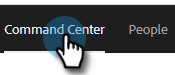

# Overzicht van geavanceerd zoeken {#advanced-search-overview}

Door de geavanceerde zoekopdracht te gebruiken voor het zoeken naar vooruitzichten die e-mails hebben weergegeven, erop hebben geklikt of erop hebben gereageerd, kunt u een gerichte lijst met uw meest betrokken vooruitzichten maken.

## Toegang tot geavanceerde zoekfunctie {#how-to-access-advanced-search}

1. Klik in de webtoepassing op **[!UICONTROL Command Center]** .

   

1. Klik op **[!UICONTROL Emails]**.

   

1. Kies het toepasselijke tabblad.

   

1. Klik op [!UICONTROL Advanced Search].

   

## Filters {#filters}

**Datum**

Kies het datumbereik voor uw zoekopdracht. Datums met voorinstellingen worden bijgewerkt afhankelijk van de e-mailstatus die u kiest ([!UICONTROL Sent], [!UICONTROL Undelivered], [!UICONTROL Pending] ).

**Who**

Filter op e-mailontvanger/afzender in de sectie [!UICONTROL Who] .

<table>
 <tr>
  <td><strong>Vervolgkeuzelijst</strong></td>
  <td><strong>Beschrijving</strong></td>
 </tr>
 <tr>
  <td><strong>[!UICONTROL View As]</strong></td>
  <td>Filter op een specifieke afzender in uw exemplaar van Sales Connect (deze optie is alleen beschikbaar voor Admins).</td>
 </tr>
 <tr>
  <td><strong>[!UICONTROL By Group]</strong></td>
  <td>E-mailberichten filteren op een specifieke groep ontvangers.</td>
 </tr>
 <tr>
  <td><strong>[!UICONTROL By Person]</strong></td>
  <td>Filteren op een specifieke ontvanger.</td>
 </tr>
</table>

**wanneer**

Kies op gemaakte datum, geleverde datum, mislukte datum of geplande datum. Welke opties beschikbaar zijn, is afhankelijk van de e-mailstatus die u kiest ( [!UICONTROL Sent], [!UICONTROL Undelivered], [!UICONTROL Pending] ).

**Campagnes**

E-mailberichten filteren op deelname aan de campagne.

**Status**

Er zijn drie e-mailstatussen waaruit u kunt kiezen. De type-/activiteitopties veranderen op basis van de geselecteerde status.

_&#x200B;**Status: Verzonden**&#x200B;_

Filters op basis van de verzonden e-mailactiviteit. U kunt [!UICONTROL views] kiezen/[!UICONTROL no views], [!UICONTROL clicks]/[!UICONTROL no clicks], en/of [!UICONTROL replies]/[!UICONTROL no replies].

_&#x200B;**Status: In afwachting van**&#x200B;_

Filtert op alle e-mails die in behandeling zijn.

<table>
 <tr>
  <td><strong>Status</strong></td>
  <td><strong>Beschrijving</strong></td>
 </tr>
 <tr>
  <td><strong>[!UICONTROL Scheduled]</strong></td>
  <td>E-mails die zijn gepland vanuit het samenstellingsvenster (Salesforce of de Web App), e-mailplug-ins of een campagne.</td>
 </tr>
 <tr>
  <td><strong>[!UICONTROL Drafts]</strong></td>
  <td>E-mails die zich momenteel in de conceptstatus bevinden. E-mails vereisen een onderwerpregel en een ontvanger om als concept te worden opgeslagen.</td>
 </tr>
 <tr>
  <td><strong>[!UICONTROL In Progress]</strong></td>
  <td>E-mails die worden verzonden. E-mails mogen niet langer dan een paar seconden in deze status blijven.</td>
 </tr>
</table>

_&#x200B;**Status: Niet bezorgd**&#x200B;_

Filters op e-mails die nooit zijn bezorgd.

<table>
 <tr>
  <td><strong>Status</strong></td>
  <td><strong>Beschrijving</strong></td>
 </tr>
 <tr>
  <td><strong>[!UICONTROL Failed]</strong></td>
  <td>Wanneer een e-mailbericht niet kan worden verzonden vanuit Sales Connect (algemene redenen zijn onder andere: e-mails die worden verzonden naar contactpersonen zonder abonnement of geblokkeerde contactpersonen, of als er een probleem is opgetreden bij het vullen van de dynamische velden).</td>
 </tr>
 <tr>
  <td><strong>[!UICONTROL Bounced]</strong></td>
  <td>Een e-mailbericht wordt gemarkeerd als teruggestuurd wanneer het wordt afgewezen door de server van de ontvanger. Hier worden alleen e-mails weergegeven die via Sales Connect-servers zijn verzonden.</td>
 </tr>
 <tr>
  <td><strong>[!UICONTROL Spam]</strong></td>
  <td>Wanneer het e-mailbericht door de ontvanger is gemarkeerd als spam (algemene term voor ongevraagde e-mail). Hier worden alleen e-mails weergegeven die via Sales Connect-servers zijn verzonden.</td>
 </tr>
</table>

## Opgeslagen zoekopdrachten {#saved-searches}

Hieronder wordt beschreven hoe u een opgeslagen zoekopdracht maakt.

1. Klik op **[!UICONTROL Save Filters As]** nadat alle filters zijn geïnstalleerd.

   

1. Geef de zoekopdracht een naam en klik op **[!UICONTROL Save]** .

   

De opgeslagen zoekopdrachten staan op de zijbalk links.

