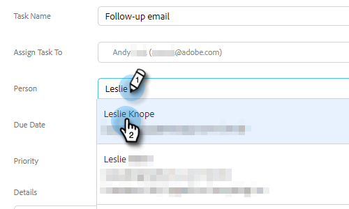

# Taken toewijzen aan teamleden {#assigning-tasks-to-team-members}

Als u met andere teamleden wilt samenwerken, kan het toewijzen van taken een grote manier zijn om uw prospectieve inspanningen te coördineren.

>[!NOTE]
>
>U kunt alleen taken toewijzen voor gedeelde contactpersonen.

1. Klik in de webtoepassing op **Opdrachtcentrum**.

   

1. Klikken **Taak toevoegen**.

   

1. Selecteer het taaktype.

   

1. Geef uw taak een naam.

   

1. Selecteer de persoon op uw team u de taak aan op het Assign gebied van de Taak wilt toewijzen.

   

1. Voeg de persoon toe u uit wilt bereiken op het persoongebied.

   

1. Selecteer de vervaldatum.

   

1. Stel de prioriteit in.

   

1. Voeg alle belangrijke details toe die relevant zijn voor uw teamgenoot (optioneel) en klik op **Maken**.

   
