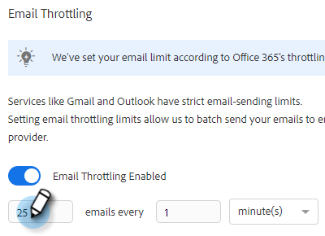

# Throtting van e-mailverbinding {#email-connection-throttling}

Door uw Sales Connect-account te integreren en via Exchange- of Gmail-providers te verzenden, biedt u een gestroomlijnde installatie en optimaliseert u de e-mailleverbaarheid voor 1:1-verkoopcommunicatie. Om systemen echter gezond te houden en accounts veilig te houden, dwingen Gmail en Exchange beperkingen in het verzenden van e-mail af. Deze limieten kunnen naar eigen goeddunken worden verhoogd of verlaagd.

## Verbindingsthrottling via e-mail (Beta) {#email-connection-throttling-beta}

Met e-mailverbindingsthrottling kunnen beheerders van Sales Connect de verzendsnelheid van e-mailberichten configureren wanneer ze Gmail of Exchange als leveringskanaal gebruiken, zodat de snelheid waarmee e-mails worden doorgegeven aan de leverancier van het leveringskanaal de afgedwongen limieten niet overschrijdt.

Wanneer de limieten consequent worden overschreden, kan dit soms worden beschouwd als verdacht gedrag van de leverancier van het leveringskanaal, waardoor e-mails mislukken en soms zelfs een account wordt uitgeschakeld.

**Notities/hooglichten**

* Automatisch ingeschakeld wanneer een gebruiker verbinding maakt met Gmail of Exchange
* Kan worden aangepast als u de instellingen wilt verhogen of verlagen ten opzichte van de aanbevelingen
* Alleen vertragingse e-mailberichten die via Gmail of Exchange worden verzonden, worden niet vertraagd voor het aangepaste leveringskanaal
* De vertraging bij het verzenden van de e-mailverbinding zorgt ervoor dat elke afzonderlijke gebruiker een e-mail ontvangt omdat elke gebruiker een eigen verbinding heeft met zijn e-mailprovider

**Instellingen voor rotatie van de e-mailverbinding configureren**

1. Klik op het tandwielpictogram en selecteer **Instellingen**.

   

1. Klik onder Beheerinstellingen op **Algemeen**.

   

1. Klik op de draaikaart voor de e-mailverbinding aan de rechterkant op de knop **E-mailrotatie inschakelen** schuifregelaar

   

1. Voer in de kaart voor het tellen van verbindingen via e-mail aan de rechterkant de gewenste batchgrootte in van e-mailberichten die naar de aanbieder van het e-mailkanaal worden verzonden.

   

1. Stel de hoeveelheid tijd in die moet worden gewacht voordat elke batch wordt verzonden. In dit voorbeeld kiezen we 25 e-mails om de 45 seconden.

   

1. Klikken **Opslaan**.

   

Als de wijzigingen zijn opgeslagen, worden de e-mails van alle gebruikers batches verzonden naar hun aangesloten Gmail- of Exchange-account voor levering.

## Limieten voor e-mailproviders {#email-provider-limits}

**Outlook 365**

Zakelijk/Enterprise

* 10.000 per dag
* 30 per minuut
* 500 ontvangers per e-mail

Meer informatie [hier te vinden](https://docs.microsoft.com/en-us/office365/servicedescriptions/exchange-online-service-description/exchange-online-limits?redirectedfrom=MSDN#RecipientLimits).

**Gmail**

* 2000 per dag (500 voor proefaccounts en accounts met vlag)
* 2 e-mails per seconde (API-limiet)
* 2.000 ontvangers per bericht (maximaal 500 voor externe ontvangers)

Meer informatie [hier te vinden](https://support.google.com/a/answer/166852?hl=en).

**Microsoft Exchange Server (2010, 2013)**

De grenzen worden geplaatst door de afdeling van IT van de organisatie aangezien de server door de organisatie wordt ontvangen. Neem contact op met de netwerk- of systeembeheerder voor aanvullende informatie.

>[!MORELIKETHIS]
>
>* [Overzicht van leveringskanaal](/help/marketo/product-docs/marketo-sales-connect/email/email-delivery/delivery-channel-overview.md)
>* [E-mailverbinding voor Gmail-gebruikers](/help/marketo/product-docs/marketo-sales-connect/email-plugins/gmail/email-connection-for-gmail-users.md)
>* [E-mailverbinding voor Outlook-gebruikers](/help/marketo/product-docs/marketo-sales-connect/email-plugins/msc-for-outlook/email-connection-for-outlook-users.md)
