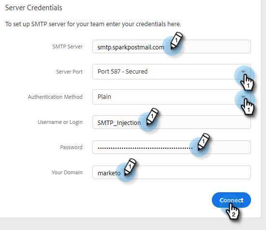

# Stel een aangepast leveringskanaal in voor uw team {#set-up-a-custom-delivery-channel-for-your-team}

>[!NOTE]
>
>**Vereiste Bevoegdheden Admin**

>[!NOTE]
>
>* Naast vestiging uw server SMTP, moet uw [ e-mailidentiteit worden geverifieerd ](/help/marketo/product-docs/marketo-sales-insight/actions/getting-started/email-settings/verify-your-email.md) alvorens u e-mails kunt verzenden.
>* Wij adviseren werkend met uw team van IT of SMTP serververkoper om de juiste servergeloofsbrieven voor uw server te krijgen SMTP.
>* U kunt uw Gmail en [!DNL Exchange] server niet verbinden gebruikend de SMTP servergeloofsbrieven. Gebruik onze E-mailverbindingsservice om deze providers te integreren.

1. Klik op het tandwielpictogram en kies **[!UICONTROL Settings]** .

   

1. Klik onder [!UICONTROL Admin Settings] op **[!UICONTROL General]** .

   

1. Klik op de tab **[!UICONTROL Team Delivery Channel]** .

   

1. Voer uw SMTP-serverreferenties in en klik op **[!UICONTROL Connect]** .

   

   >[!NOTE]
   >
   >De server van Team SMTP zal het standaardleveringskanaal van de standaard e-mailidentiteit voor alle teamleden zijn. Bovendien is deze beschikbaar als optie voor het leveringskanaal voor alle andere e-mailidentiteiten.

   >[!MORELIKETHIS]
   >
   >* [ E-mailVerbinding voor de Gebruikers van Gmail ](/help/marketo/product-docs/marketo-sales-connect/email-plugins/gmail/email-connection-for-gmail-users.md)
   >* [ E-mailVerbinding voor  [!DNL Outlook]  Gebruikers ](/help/marketo/product-docs/marketo-sales-connect/email-plugins/msc-for-outlook/email-connection-for-outlook-users.md)
