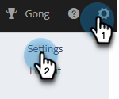

# Instelling voor automatisch toevoegen van abonnement op bericht {#auto-append-unsubscribe-message-setting}

Zorg ervoor dat elke verzonden e-mail met het oog op het instellen van een abonnement een afmeldingsbericht bevat, zodat ontvangers de mogelijkheid hebben om zich af te melden. Wanneer het toevoegen van een afmeldingsbericht is ingeschakeld, wordt in alle communicatie die uw team verzendt van Marketo Sales een afmeldingsbericht weergegeven, inclusief e-mailberichten die zijn verzonden vanuit de webtoepassing en Salesforce.

>[!NOTE]
>
>Als u het `{{team_unsubscribe}}` dynamisch veld in een e-mailsjabloon en de instelling voor het toevoegen van een bericht voor afmelden is ingeschakeld. Het dynamische veld voor het afmelden van een abonnement vult het afmeldingsbericht in _in plaats van_ je afmeldingsbericht toevoegen.

## Toevoegen via abonnement in-/uitschakelen {#enable-disable-unsubscribe-append}

1. Klik op het tandwielpictogram en selecteer **Instellingen**.

   

1. Klik onder Beheerinstellingen op **Abonnementen opzeggen**.

   

1. Verplaats de schuifregelaar op het tabblad Berichten onder Bericht bij opzeggen toevoegen naar de gewenste status.

   

>[!TIP]
>
>Als u het toevoegen onbruikbaar maakt unsubscribe bericht plaatsen, adviseren wij toevoegend een unsubscribe footer aan uw malplaatjes om ervoor te zorgen uw mededeling een opt-out optie heeft. U kunt dit doen door uw eigen douanebericht aan elke malplaatje toe te voegen, of door te gebruiken `{{team_unsubscribe}}` [dynamisch veld](/help/marketo/product-docs/marketo-sales-insight/actions/templates/dynamic-fields.md){target="_blank"}.
