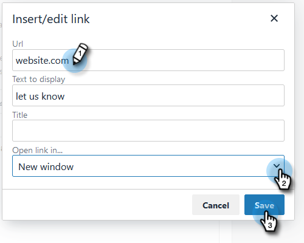

# Bericht voor opzeggen van koppeling aanpassen {#customize-unsubscribe-link-message}

Wij hebben teams altijd toegestaan om hun unsubscribe verbindingsoverseinen aan te passen, maar de beheerders hebben de optie om het unsubscribe verbindingsoverseinen voor hun volledige team te plaatsen om verenigbaar overseinen te verzekeren.

>[!NOTE]
>
>U kunt een derdeunsubscribe-koppeling met [!DNL Marketo Sales] niet gebruiken omdat deze informatie niet opnieuw in onze database wordt vastgelegd.

1. Klik op het tandwielpictogram en selecteer **[!UICONTROL Settings]** .

   

1. Klik onder [!UICONTROL Admin Settings] op **[!UICONTROL Unsubscribes]** .

   

1. Bepaal als dit bericht het gebrek voor uw volledig team zal zijn, of als u het team wilt laten hun eigen overseinen tot stand brengen (in dit voorbeeld, kiezen wij standaardoverseinen). Schrijf uw aangepast bericht in het tekstvak uit.

   

1. Markeer de tekst waarop u wilt klikken om naar de afmeldingspagina te gaan en klik vervolgens op het koppelingspictogram.

   

   >[!NOTE]
   >
   >Het maakt niet uit welke URL u invoert. Wanneer het e-mailbericht wordt verzonden, wordt de eerste (of enige) hyperlink automatisch gekoppeld aan de standaardpagina voor het opzeggen van het abonnement.

1. Voer een URL in, bepaal of u de koppeling in het huidige of een nieuw venster wilt openen en klik op **[!UICONTROL Save]** .

   

1. Klik op **[!UICONTROL Save]** onder aan om de wijzigingen op te slaan.

   
