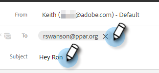
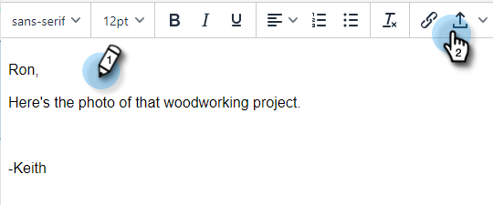
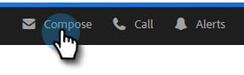

# Een bijlage of traceerbare inhoud toevoegen aan uw e-mail {#add-an-attachment-or-trackable-content-to-your-email}

Wanneer u een e-mail verzendt via [!DNL Marketo Sales] , kunt u een bestand toevoegen als bijlage of een bestand als downloadbare (en trackable) koppeling maken.

>[!NOTE]
>
>Gewoonlijk zijn bestanden van meer dan 20 MB te groot om te worden geleverd. De grootte van een bijlage die u via e-mail kunt verzenden, is afhankelijk van het verzendkanaal voor de e-mail dat u gebruikt.

## Een bijlage toevoegen {#add-an-attachment}

1. Maak uw e-mailconcept (hiervoor zijn meerdere manieren, in dit voorbeeld kiezen we **[!UICONTROL Compose]** in de koptekst).

   

1. Vul het veld [!UICONTROL To] en voer een [!UICONTROL Subject] in.

   

1. Klik op het bevestigingspictogram.

   

1. Selecteer het bestand dat u wilt bijvoegen en klik op **[!UICONTROL Insert]** .

   

   >[!NOTE]
   >
   >Als u een bestand moet uploaden, klikt u op de knop **[!UICONTROL Upload Content]** rechtsboven in het venster.

   De bijlage wordt onder aan het e-mailbericht weergegeven.

   

## Overtrekbare inhoud toevoegen {#add-trackable-content}

1. Maak uw e-mailconcept (hiervoor zijn meerdere manieren, in dit voorbeeld kiezen we het venster **[!UICONTROL Compose]** ).

   

1. Vul het veld [!UICONTROL To] en voer een [!UICONTROL Subject] in.

   

1. Klik op de plaats in de e-mail waarvan u de traceerbare inhoud wilt weergeven en klik op het pictogram voor bijlagen.

   

1. Selecteer de inhoud die u wilt toevoegen, klik op de schuifregelaar **[!UICONTROL Content is tracked]** en klik op **[!UICONTROL Insert]** .

   

   >[!NOTE]
   >
   >Als u een bestand moet uploaden, klikt u op de knop **[!UICONTROL Upload Content]** rechtsboven in het venster.

   De inhoud wordt als een koppeling in uw e-mail weergegeven. De ontvanger kan op de koppeling klikken om de inhoud te downloaden.

   

   >[!NOTE]
   >
   >Gebruikers worden op de hoogte gesteld in Live feed wanneer mensen hun bijgehouden inhoud bekijken. Gebruikers kunnen ook de inhoud zien die het best wordt uitgevoerd in de inhoudsectie van de pagina Analytics.

## Updates voor traceerbare inhoud {#trackable-content-updates}

**Trackable Content Viewer**

Wanneer een lead op traceerbare inhoud in uw e-mail klikt, wordt een inhoudsviewer geopend.

De leads in de inhoudsviewer kunnen het volgende doen.

* Het document downloaden

* Door het document bladeren

* De contactgegevens van de afzender weergeven

**Trackable Content Events in Live Feed**

Wanneer een lead op de koppeling van ons document klikt, wordt een klikgebeurtenis weergegeven. U kunt op die koppeling klikken om de inhoud weer te geven. Zolang u bij uw rekening van Acties in browser wordt aangemeld, zullen wij deze klikken niet als gebeurtenissen tellen.

Telkens wanneer de lead naar een andere pagina in het document gaat, ontvangt u een gebeurtenis Viewed in de Live Feed met de naam van het document.
