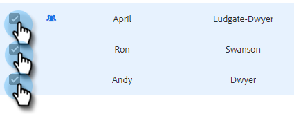

# Bulke-mails samenstellen met Selecteren en Verzenden {#composing-bulk-emails-with-select-and-send}

Hieronder wordt beschreven hoe u e-mailberichten verzendt/bewerkt met de optie [!UICONTROL Select] en [!UICONTROL Send] .

## E-mails verzenden {#sending-emails}

1. Navigeer naar de map **[!UICONTROL People page]** .

   

1. Selecteer de personen die u per e-mail wilt verzenden.

   

   >[!NOTE]
   >
   >U kunt maximaal 200 personen selecteren bij het gebruik van Selecteren en Verzenden.

1. Klik op **[!UICONTROL Email Selected]** .

   

1. Ga een onderwerpregel in, selecteer een malplaatje (of stel e-mail van kras samen), en verzend/ [&#x200B; programma &#x200B;](/help/marketo/product-docs/marketo-sales-connect/email/using-the-compose-window/scheduling-an-email.md) e-mail.

   

   >[!NOTE]
   >
   >Als u een sjabloon hebt geselecteerd en u wilt controleren of alle dynamische velden correct zijn ingevuld voordat u deze verzendt, klikt u op **[!UICONTROL Preview Dynamic Fields]** . Zorg ervoor dat alle ontvangers in de grote zijbalk zijn geselecteerd om een voorvertoning van alle e-mails weer te geven. Als u één e-mail selecteert en op **[!UICONTROL Preview Dynamic Fields]** klikt, wordt alleen een voorbeeld van die e-mail weergegeven.

## E-mails bewerken {#editing-emails}

**Bulk geeft** uit

1. Volg Stappen 1-3 van de [&#x200B; Verzendende sectie E-mail &#x200B;](#sending-emails) hierboven.

   >[!NOTE]
   >
   >Alle ontvangers worden standaard geselecteerd. Als u op een individu klikt en iedereen opnieuw wilt selecteren, klikt u op **[!UICONTROL All Recipients]** . Ter herinnering: alle ontvangers moeten worden geselecteerd om bulkbewerkingen uit te voeren.

1. Breng de gewenste wijzigingen aan in de editor. U kunt een nieuwe e-mail maken of een sjabloon bewerken (in dit voorbeeld maken we een nieuwe e-mail).

   

   >[!NOTE]
   >
   >U kunt op een specifieke e-mailontvanger klikken om de wijzigingen te zien die aan die e-mail zijn doorgegeven.

1. Klik op **[!UICONTROL Send]** (of [[!UICONTROL Schedule]](/help/marketo/product-docs/marketo-sales-connect/email/using-the-compose-window/scheduling-an-email.md) ) om de bulkmail-updates die u hebt aangebracht naar alle ontvangers te verzenden.

   

**geef Elk E-mail** uit

Voltooi Bulk Updates voordat u elke e-mail aanpast. Als u een bulkupdate aanbrengt, worden de wijzigingen in elke e-mail in het bulkcompositiezijpaneel overschreven.

1. Volg Stappen 1-4 van de [&#x200B; Verzendende sectie E-mail &#x200B;](#sending-emails).

   >[!NOTE]
   >
   >Alle ontvangers worden standaard geselecteerd. Als u op een individu klikt en iedereen opnieuw wilt selecteren, klikt u op **[!UICONTROL All Recipients]** . Ter herinnering: alle ontvangers moeten worden geselecteerd om bulkbewerkingen uit te voeren.

1. Selecteer een individuele ontvanger.

   

1. Breng de gewenste wijzigingen aan in de editor.

   

   >[!NOTE]
   >
   >Hier kunt u wijzigingen aanbrengen in één e-mailbericht op de grote zijbalk zonder de overige e-mails bij te werken.

   >[!TIP]
   >
   >U kunt op andere ontvangers klikken om te zien dat de wijzigingen die u in de eerder geselecteerde ontvanger hebt aangebracht, niet zichtbaar zijn.

1. Klik op **[!UICONTROL Send]** (of [[!UICONTROL Schedule]](/help/marketo/product-docs/marketo-sales-connect/email/using-the-compose-window/scheduling-an-email.md) ) om de bulkmail-updates die u hebt aangebracht naar alle ontvangers te verzenden.

   

   >[!MORELIKETHIS]
   >
   >* [&#x200B; Onduidelijke het Emailen Opties &#x200B;](/help/marketo/product-docs/marketo-sales-insight/actions/email/using-the-compose-window/bulk-emailing-options.md)
   >* [&#x200B; Gebruikend een Malplaatje in Samenstellen Venster &#x200B;](/help/marketo/product-docs/marketo-sales-connect/email/using-the-compose-window/using-a-template-in-the-compose-window.md)
   >* [&#x200B; Dynamische Gebieden &#x200B;](/help/marketo/product-docs/marketo-sales-connect/templates/dynamic-fields/how-to-insert-dynamic-fields.md)
