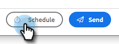

# Een e-mail plannen {#scheduling-an-email}

Volg deze eenvoudige stappen om een e-mail te plannen.

>[!NOTE]
>
>Ga naar de pagina Instellingen om de standaardtijdzone bij te werken.

1. Creeer uw e-mailontwerp (er zijn veelvoudige manieren om dit te doen, in dit voorbeeld kiezen wij **samenstellen** in de kopbal).

   

1. Wanneer u wordt gedaan samenstellend uw e-mail, klik **Programma** op de bodem recht

   

1. Klik op de datum waarop u de datumkiezer wilt openen en selecteer een datum.

   

1. Voer de tijd in waarop het e-mailbericht moet verschijnen. Selecteer de gewenste tijdzone en klik **sparen**. Sluit de planner wanneer gedaan.

   

1. Nu uw geplande datum/tijd wordt geselecteerd, verzendt de klik **&#x200B;**&#x200B;om e-mail te plannen.

   

   >[!NOTE]
   >
   >Gepland e-mailbericht kan worden weergegeven/bewerkt in de sectie voor geplande mappen van het Opdrachtcentrum.

   >[!MORELIKETHIS]
   >
   >[ Overzicht van het Centrum van het Bevel ](/help/marketo/product-docs/marketo-sales-insight/actions/email/command-center/command-center-overview.md)
