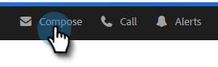
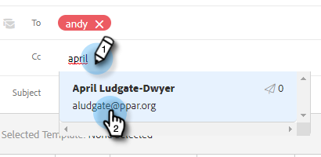

# Een bijgehouden e-mail verzenden {#sending-a-tracked-email}

Wanneer u een e-mail verzendt met Marketo Sales Connect, worden de weergaven (e-mail wordt geopend) en klikken (op koppelingen) bijgehouden.

>[!PREREQUISITES]
>
>U moet een identiteit laten verifiëren en een e-mailleveringskanaal instellen voordat u een bijgehouden e-mail verzendt.
>
>* [ verifieer uw e-mailadres ](/help/marketo/product-docs/marketo-sales-insight/actions/getting-started/email-settings/verify-your-email.md)
>* Opstelling een Kanaal van de Levering voor [ Vooruitzichten ](/help/marketo/product-docs/marketo-sales-connect/email-plugins/msc-for-outlook/email-connection-for-outlook-users.md) of [ Gmail ](/help/marketo/product-docs/marketo-sales-connect/email-plugins/gmail/email-connection-for-gmail-users.md)

1. Creeer uw e-mailontwerp (er zijn veelvoudige manieren om dit te doen, in dit voorbeeld kiezen wij **samenstellen** in de kopbal).

   

1. Ga de naam of e-mail van een ontvanger op het **in** gebied.

   

   >[!NOTE]
   >
   >U kunt slechts één persoon in het veld Aan plaatsen.

1. Voeg ontvangers die u wilt gebruiken voor CC of BCC toe aan de betreffende velden.

   

   >[!NOTE]
   >
   >Als iemand die CC of BCC is geweest e-mail opent, zal dat open als mening op het verslag van de persoon op **aan** gebied worden geregistreerd.

1. Voeg een onderwerpregel toe.

   

   >[!NOTE]
   >
   >Een onderwerpregel en een ontvanger zijn vereist om de e-mail te verzenden. Wij zullen **automatisch uw ontwerp** bewaren zodra een onderwerpregel en een ontvanger zijn toegevoegd.

1. Stel uw e-mail samen met de editor. Klik **verzenden** (of [ Programma ](/help/marketo/product-docs/marketo-sales-connect/email/using-the-compose-window/scheduling-an-email.md), als u verkiest) wanneer gedaan.

   

   >[!MORELIKETHIS]
   >
   >* [ Plannend een E-mail ](/help/marketo/product-docs/marketo-sales-insight/actions/email/using-the-compose-window/scheduling-an-email.md)
   >* [ Malplaatjes ](/help/marketo/product-docs/marketo-sales-insight/actions/templates/manage-templates.md#create-a-new-template)
