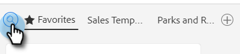

# Een sjabloon gebruiken in het venster Samenstellen {#using-a-template-in-the-compose-window}

## Sjablonen zoeken en gebruiken {#finding-and-using-templates}

1. Maak uw e-mailconcept (hiervoor zijn meerdere manieren, in dit voorbeeld kiezen we **[!UICONTROL Compose]** in de koptekst).

   

1. Vul het veld [!UICONTROL To].

   

1. Klik op het zoekpictogram in de sjabloonsectie om het zoekveld voor de sjabloon te openen.

   

1. Selecteer een categorie waarin u wilt zoeken (of selecteer [!UICONTROL All] om in alle categorieën te zoeken).

   

1. Zoeken op sjabloonnaam, onderwerpregel of tekst van de e-mail. Klik op de gewenste sjabloon om deze te selecteren.

   

   >[!NOTE]
   >
   >Als u een andere sjabloon selecteert, worden alle gegevens vervangen die momenteel in de editor staan. Als u wijzigingen aanbrengt, moet u deze kopiëren voordat u een andere sjabloon selecteert.

## Sjablooncategorieën vastzetten in het venster Samenstellen {#pinning-template-categories-in-the-compose-window}

Favoriet **tot vijf** specifieke malplaatjecategorieën om snelle toegang tot uw meest gebruikte malplaatjes te krijgen.

1. Maak uw e-mailconcept (hiervoor zijn meerdere manieren, in dit voorbeeld kiezen we **[!UICONTROL Compose]** in de koptekst).

   

1. Klik op het pictogram **+** naast [!UICONTROL Favorites] .

   

1. Klik op de vervolgkeuzelijst **[!UICONTROL Pin a Category]** en selecteer de gewenste categorie.

   

   >[!TIP]
   >
   >We raden u aan de categorie Alles vast te zetten om u snel toegang te geven tot het zoeken in uw volledige sjabloonbibliotheek, aangezien u vaak door al uw sjablonen moet zoeken om te zoeken naar wat u zoekt. Wanneer u een vastgezette categorie hebt geselecteerd en op het zoekpictogram klikt, wordt de zoekopdracht standaard uitgevoerd op de zoekopdracht in de vastgezette categorie die is geselecteerd.

1. Klik **sparen Veranderingen** wanneer gedaan (facultatief: herhaal Stap 3 om meer toe te voegen).

   

   >[!TIP]
   >
   >U kunt de volgorde van de vastgezette categorieën wijzigen door gewoon te slepen en neer te zetten voordat u de wijzigingen opslaat.

   

   >[!NOTE]
   >
   >**[!UICONTROL Favorites]** is er standaard. Deze bevat favoriete e-mailsjablonen, geen rubrieken.

   Je geselecteerde rubriek is nu vastgezet.
