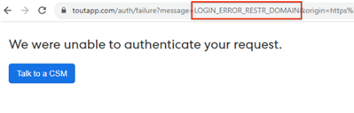

# Hoe bevestig ik &quot;wij konden uw verzoek&quot;niet verklaren wanneer het verbinden met Salesforce {#how-do-i-fix-we-were-unable-to-authenticate-your-request-when-connecting-to-salesforce}

Als u probeert om uw exemplaar van de Verkoop van Marketo aan Salesforce aan te sluiten en u de fout &quot;Wij kunnen uw verzoek niet voor authentiek verklaren&quot;ziet, is het waarschijnlijk verwant aan hoe uw instantie Salesforce wordt gevormd.

Er zijn twee soorten fouten die deze mislukte verificatiepagina kunnen veroorzaken.

* Toegangsfout beperkt domein voor aanmelding
* Oauth App Blocked

U kunt bepalen welk type u krijgt door URL te controleren.

## Oplossen van aanmeldfout met beperkt domein {#resolve-login-error-restricted-domain}

Deze fout wijst typisch op u een douanedomein hebt dat wij niet aan kunnen leiden. U lost deze fout op door u aan te melden bij de Salesforce-instantie waarmee u eerst verbinding wilt maken. Voer vervolgens de stappen uit om verbinding te maken met Salesforce.

Als de instantie u probeert om met een domein te verbinden Salesforce Sandbox is en u een fout krijgt, zult u door extra stappen moeten gaan om uw instantie bij te werken om Salesforce Sandbox compatibel te zijn. [Meer informatie](/help/marketo/product-docs/marketo-sales-insight/actions/crm/salesforce-integration/set-up-a-sales-insight-actions-sandbox.md){target="_blank"}.

## Oauth App Blocked en andere fouttypen oplossen {#resolve-oauth-app-blocked-and-other-error-types}

Als u het foutbericht &quot;We konden uw verzoek niet verifiëren&quot; ontvangt met het fouttype Oauth App Blocked of een ander type in de URL, is er mogelijk een beperking op uw toegang tot de API van Salesforce. Neem contact op met uw Salesforce Admin om te controleren of de volgende functies aanwezig zijn.

### API inschakelen in gebruikersmachtigingen {#enable-api-in-user-permissions}

1. Laat een Salesforce Admin-aanmelding bij Salesforce.
1. Selecteren **Instellen**.
1. Selecteren **Gebruikers beheren**.
1. Selecteren **Profielen**.
1. Zoek het profiel onder de ToutApp-gebruikers en klik op **Bewerken**.
1. Omlaag schuiven naar **Administratieve machtigingen** en zorg ervoor **API ingeschakeld** is ingeschakeld.

### Controleren of Salesforce de Acties van het Inzicht van de Verkoop van Verbinding blokkeert {#check-if-salesforce-is-blocking-sales-insight-actions-from-connecting}

1. Laat een Salesforce Admin-aanmelding bij Salesforce.
1. Selecteren **Instellen**.
1. Selecteren **Apps beheren**.
1. Selecteren **OAuth-gebruik van aangesloten apps**.
1. Zorg ervoor dat de Acties van het Inzicht van de Verkoop &quot;Blok&quot;naast het tonen. Als u &quot;Unblock ziet,&quot;klik de knoop om de Acties van het Inzicht van de Verkoop tot Salesforce open te stellen.
